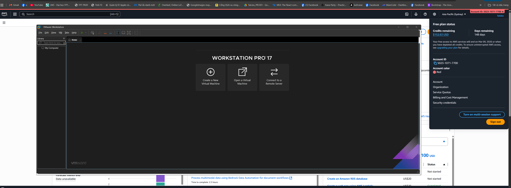

### Week 4 Objectives:

* Gain in-depth understanding of AWS’s core storage service — **Amazon S3**.
* Master key concepts: bucket, object, storage class, access point, static website hosting, and CORS.
* Learn about hybrid storage and data migration solutions such as **AWS Storage Gateway** and **Snow Family**.
* Get familiar with **FSx for Windows File Server** and automated backup services using **AWS Backup**.
* Practice deploying, managing, and integrating AWS storage services in real-world environments.

---

### Tasks for the Week:

| Day | Task | Start Date | Completion Date | Reference |
|-----|------|-------------|-----------------|------------|
| 2 | - Study the theory of **AWS Storage Service (S3)** – *Module 04-01*.   - Learn about the concept of Buckets, Objects, and storage mechanism. | 29/09/2025 | 29/09/2025 | https://docs.aws.amazon.com/s3/ |
| 3 | - Learn about **Access Point** and **Storage Classes** in S3 – *Module 04-02*.   - Differentiate storage classes: Standard, IA, Glacier, Deep Archive. | 30/09/2025 | 30/09/2025 | https://docs.aws.amazon.com/AmazonS3/latest/dev/storage-class-intro.html |
| 4 | - Explore **S3 Static Website & CORS**, Access Control, Object Key, Performance, and Glacier – *Module 04-03*. | 01/10/2025 | 01/10/2025 | https://docs.aws.amazon.com/AmazonS3/latest/userguide/WebsiteHosting.html |
| 5 | - **Lab Practice:** *Module 04-Lab13 – Deploy AWS Backup to the System.*   - **Lab Practice:** *Module 04-Lab14 – VM Import/Export.* | 02/10/2025 | 02/10/2025 | [Lab13](https://000013.awsstudygroup.com/), [Lab14](https://000014.awsstudygroup.com/) |
| 6 | - **Lab Practice:** *Module 04-Lab24 – Using File Storage Gateway.*   - **Lab Practice:** *Module 04-Lab25 – Amazon FSx for Windows File Server.*   - Review and summarize all AWS Storage Service concepts. | 03/10/2025 | 03/10/2025 | [Lab24](https://000024.awsstudygroup.com/), [Lab25](https://000025.awsstudygroup.com/) |

---

### Achievements in Week 4:

* Developed a clear understanding of the **architecture and functionality of Amazon S3**, including:
    * Creating and managing Buckets and Objects.
    * Understanding **Storage Classes** and cost optimization strategies.
    * Configuring **S3 Static Website Hosting** and handling **CORS** for web applications.

* Learned about **S3 Glacier**, a cold storage solution that minimizes costs for infrequently accessed data.

* Gained insights into **Hybrid Storage & Data Migration** through:
    * **AWS Snow Family** (Snowcone, Snowball, Snowmobile).
    * **AWS Storage Gateway** – connecting on-premises storage with AWS Cloud.

* Successfully completed practical labs:
## Lab 13 :
* **AWS Backup** – configured and deployed resource backups.
  > Step 1 :
  * 
  > Step 2 :
  * 
  > Step 3 :
  * 
  > Step 4 :
  * 
  > Sucess :
  * 
## Lab 14 :
* **VM Import/Export** – migrated virtual machines between local and AWS environments.
    > Step 1 :
  * 
    > Sucess :
  * 
    > Step 2 :
  * 
    > Step 3 :
  * 
    > Step 4 :
  * 
    >Step 5 :
  * 

## Lab 24 :
* **File Storage Gateway** – created and connected file storage between on-premises and AWS.
    > 

## Lab 25 :
* **Amazon FSx for Windows File Server** – deployed a fully managed Windows file storage system.

* Completed **Module 04 – AWS Storage Services**, building a solid foundation for upcoming modules on compute, databases, and cloud security.

---
