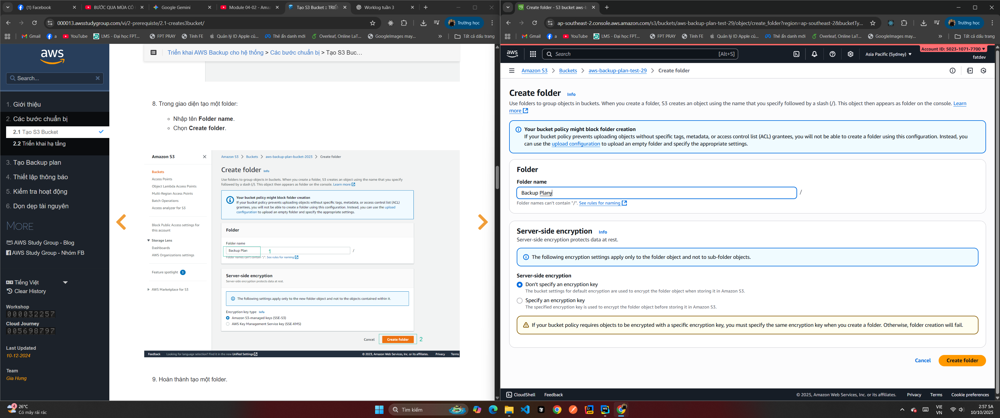
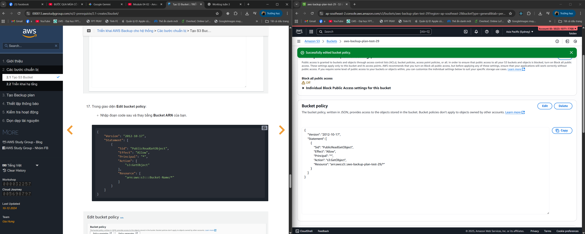
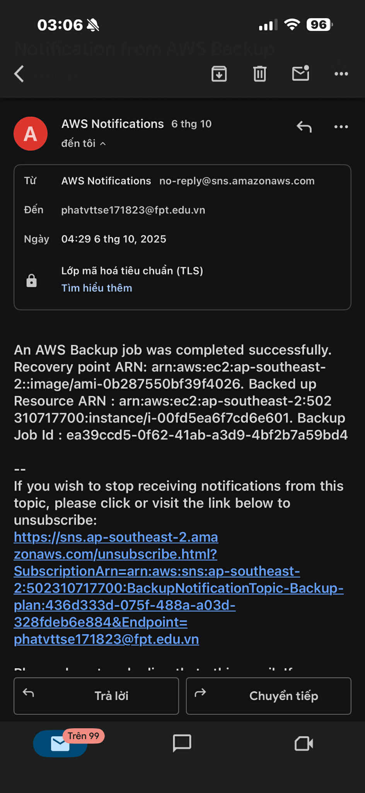
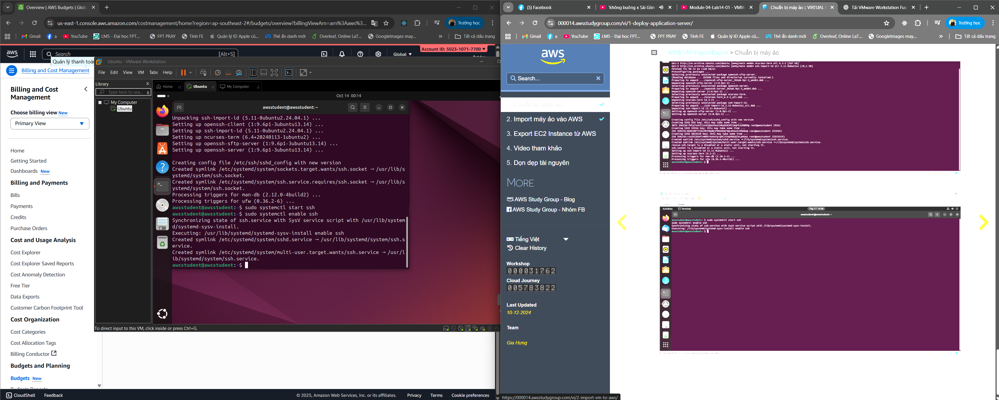
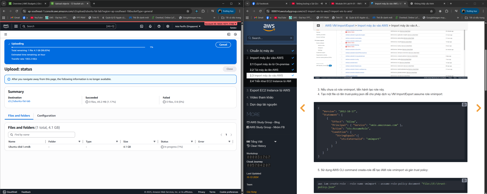
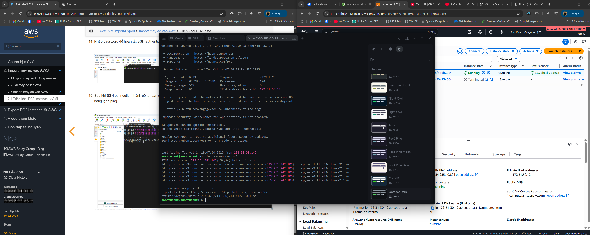
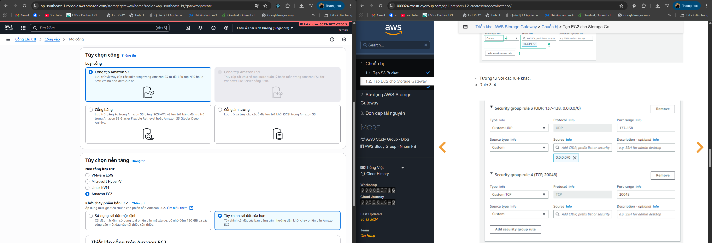
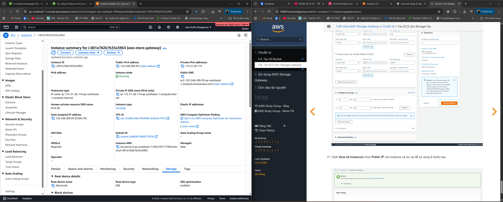
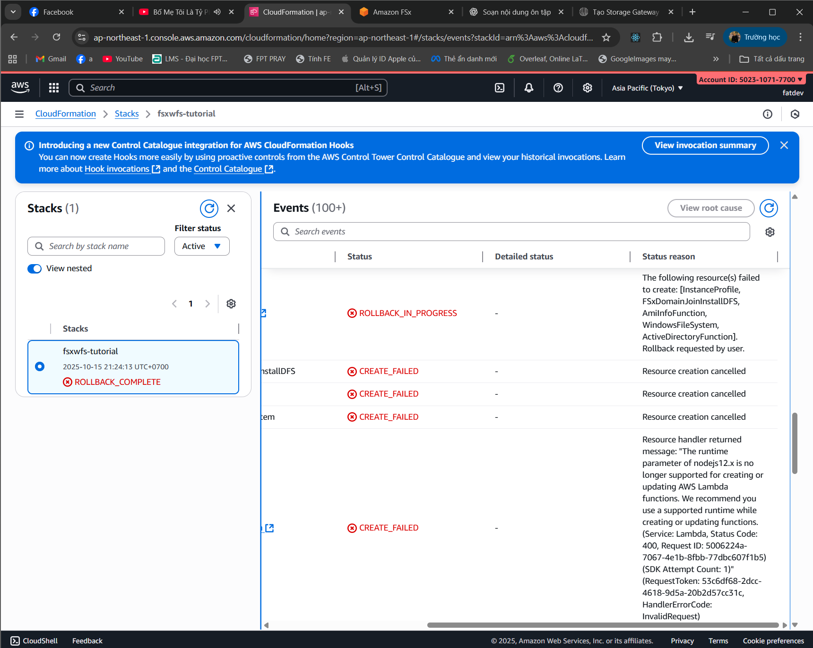
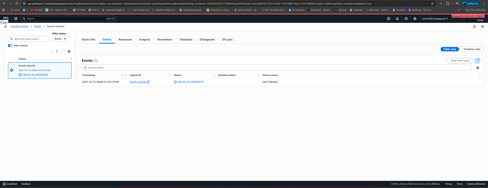

### Week 4 Objectives

- Gain an in-depth understanding of AWS’s core storage service **Amazon S3**.
- Master the key concepts: **bucket**, **object**, **storage class**, **access point**, **static website hosting**, and **CORS**.
- Study hybrid storage and data migration solutions such as **AWS Storage Gateway** and **AWS Snow Family**.
- Get familiar with **Amazon FSx for Windows File Server** and the automated backup service **AWS Backup**.
- Practice deploying, managing, and integrating AWS storage services in a real-world environment.

---

### Tasks to Be Completed in Week 4

| Day | Task                                                                                                                                                                                                 | Start Date | Completion Date | References                                                                                 |
| --- | ---------------------------------------------------------------------------------------------------------------------------------------------------------------------------------------------------- | ---------- | ---------------- | ------------------------------------------------------------------------------------------ |
| 2   | - Study the theory of **AWS Storage Service (S3)** – _Module 04-01_.  - Get familiar with the concepts of **Bucket**, **Object**, and the storage mechanism.                                      | 29/09/2025 | 29/09/2025       | https://docs.aws.amazon.com/s3/                                                            |
| 3   | - Learn about **Access Point** and **Storage Class** in S3 – _Module 04-02_.  - Distinguish between storage classes: **Standard**, **IA**, **Glacier**, **Deep Archive**.                         | 30/09/2025 | 30/09/2025       | https://docs.aws.amazon.com/AmazonS3/latest/dev/storage-class-intro.html                   |
| 4   | - Explore **S3 Static Website & CORS**, **Access Control**, **Object Key**, **Performance**, and **Glacier** – _Module 04-03_.                                                                      | 01/10/2025 | 01/10/2025       | https://docs.aws.amazon.com/AmazonS3/latest/userguide/WebsiteHosting.html                  |
| 5   | - **Hands-on:** _Module 04-Lab13 – Deploy AWS Backup to the System_.  - **Hands-on:** _Module 04-Lab14 – VM Import/Export_.                                                                      | 02/10/2025 | 02/10/2025       | [Lab13](https://000013.awsstudygroup.com/), [Lab14](https://000014.awsstudygroup.com/)     |
| 6   | - **Hands-on:** _Module 04-Lab24 – Using File Storage Gateway_.  - **Hands-on:** _Module 04-Lab25 – Amazon FSx for Windows File Server_.  - Review and consolidate all AWS storage services. | 03/10/2025 | 03/10/2025       | [Lab24](https://000024.awsstudygroup.com/), [Lab25](https://000025.awsstudygroup.com/)     |

---

### Results Achieved in Week 4

- Gained a clear understanding of the **architecture and operating principles of Amazon S3**, including:
    - How to create and manage **Buckets**, **Objects**, and **Access Policies**.
    - Different **Storage Classes** and strategies for optimizing storage costs.
    - How to configure **S3 Static Website Hosting** and handle **CORS** for web applications.

- Became familiar with **S3 Glacier** – a cold storage service that helps save costs for infrequently accessed data.

- Gained a solid understanding of **Hybrid Storage & Data Migration** through:
    - **AWS Snow Family** (Snowcone, Snowball, Snowmobile).
    - **AWS Storage Gateway** – a solution to connect on-premises systems with AWS Cloud.

- Successfully completed the following labs:

---

## Lab 13 – AWS Backup

- **Goal:** Configure and deploy resource backups with **AWS Backup**.

> Step 1:  
> 

> Step 2:  
> 

> Step 3:  
> 

> Step 4:  
> 

> Success:  
> 

---

## Lab 14 – VM Import/Export

- **Goal:** Perform **VM Import/Export** – migrate virtual machines between the local environment and AWS.

> Step 1:  
> 

> Success:  
> 

> Step 2:  
> 

> Step 3:  
> 

> Step 4:  
> 

> Step 5:  
> 

> Step 6 (successfully uploaded the VM to EC2 (AMIs)):  
> 

> Step 7:  
> 

> Step 8 (Internet connectivity test):  
> 

> Step 9:  
> 

> Step 10 (Done):  
> 

---

## Lab 24 – File Storage Gateway

- **Goal:** Configure **File Storage Gateway** – create and link file storage between on-premises systems and AWS.

> Note: The account must be upgraded.  
> 

> Step 1 – After creating the S3 bucket, create the File Storage Gateway (FSG):  
> 

> Step 2 – EC2 settings:  
>   
> 

> Step 3:  
> 

---

## Lab 25 – Amazon FSx for Windows File Server

- **Goal:** Deploy a file storage system for Windows using **Amazon FSx for Windows File Server**.

> Step 1 (Lambda error – Node.js version):  
> 

> Step 2:  
> 

---

- Completed the entire **Module 04 – AWS Storage Services**, building a solid foundation to move on to compute, database, and security services in the following weeks.
