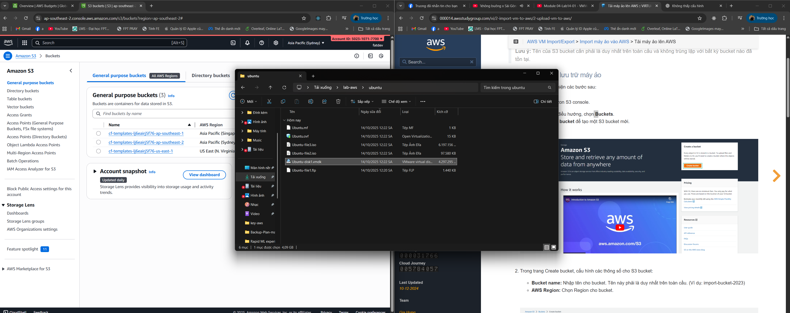

### Mục tiêu tuần 4:

- Hiểu sâu về dịch vụ lưu trữ cốt lõi của AWS là **Amazon S3**.
- Nắm vững các khái niệm: bucket, object, storage class, access point, static website hosting, và CORS.
- Tìm hiểu các giải pháp lưu trữ lai (hybrid storage) và di chuyển dữ liệu như **Storage Gateway** và **Snow Family**.
- Làm quen với **FSx for Windows File Server** và dịch vụ sao lưu tự động **AWS Backup**.
- Thực hành triển khai, quản lý và kết nối các dịch vụ lưu trữ AWS trong môi trường thực tế.

---

### Công việc cần thực hiện trong tuần:

| Ngày | Công việc                                                                                                                                                                                                         | Ngày bắt đầu | Ngày hoàn thành | Tài liệu tham khảo                                                                     |
| ---- | ----------------------------------------------------------------------------------------------------------------------------------------------------------------------------------------------------------------- | ------------ | --------------- | -------------------------------------------------------------------------------------- |
| 2    | - Nghiên cứu lý thuyết **Dịch vụ Lưu trữ trên AWS (S3)** – _Module 04-01_.   - Làm quen với khái niệm Bucket, Object và cơ chế lưu trữ.                                                                        | 29/09/2025   | 29/09/2025      | https://docs.aws.amazon.com/s3/                                                        |
| 3    | - Học về **Access Point** và **Storage Class** trong S3 – _Module 04-02_.   - Phân biệt các loại storage class: Standard, IA, Glacier, Deep Archive.                                                           | 30/09/2025   | 30/09/2025      | https://docs.aws.amazon.com/AmazonS3/latest/dev/storage-class-intro.html               |
| 4    | - Tìm hiểu **S3 Static Website & CORS**, quyền truy cập (Access Control), Object Key, Performance, Glacier – _Module 04-03_.                                                                                      | 01/10/2025   | 01/10/2025      | https://docs.aws.amazon.com/AmazonS3/latest/userguide/WebsiteHosting.html              |
| 5    | - **Thực hành:** _Module 04-Lab13 – Deploy AWS Backup to the System_.   - **Thực hành:** _Module 04-Lab14 – VM Import/Export_.                                                                                 | 02/10/2025   | 02/10/2025      | [Lab13](https://000013.awsstudygroup.com/), [Lab14](https://000014.awsstudygroup.com/) |
| 6    | - **Thực hành:** _Module 04-Lab24 – Using File Storage Gateway_.   - **Thực hành:** _Module 04-Lab25 – Amazon FSx for Windows File Server_.   - Ôn tập và tổng hợp toàn bộ nội dung về dịch vụ lưu trữ AWS. | 03/10/2025   | 03/10/2025      | [Lab24](https://000024.awsstudygroup.com/), [Lab25](https://000025.awsstudygroup.com/) |

---

### Kết quả đạt được trong Tuần 4:

- Hiểu rõ **kiến trúc và nguyên lý hoạt động của Amazon S3**, bao gồm:

  - Cách tạo và quản lý Bucket, Object, và chính sách truy cập (Access Policy).
  - Các **Storage Classes** khác nhau và chiến lược tối ưu chi phí lưu trữ.
  - Cấu hình **S3 Static Website Hosting** và xử lý CORS cho ứng dụng web.

- Làm quen với **S3 Glacier** – dịch vụ lưu trữ lạnh, tiết kiệm chi phí cho dữ liệu ít truy cập.

- Nắm vững khái niệm **Hybrid Storage & Data Migration** thông qua:

  - **AWS Snow Family** (Snowcone, Snowball, Snowmobile).
  - **AWS Storage Gateway** – giải pháp kết nối giữa hệ thống on-premises và đám mây AWS.

- Thực hành thành công các lab:

## Lab 13 :

- **AWS Backup** – cấu hình và triển khai sao lưu tài nguyên.
  > Step 1 :
  - 
    > Step 2 :
  - 
    > Step 3 :
  - 
    > Step 4 :
  - 
    > Sucess :
  - 

## Lab 14 :

- **VM Import/Export** – chuyển đổi máy ảo giữa môi trường cục bộ và AWS.
  > Step 1 :
  - 
    > Sucess :
  - 
    > Step 2 :
  - 
    > Step 3 :
  - 
    > Step 4 :
  - 
    > Step 5 :
  - 
    > Step 6 ( thành công tải máy ảo lên EC2 (AMIs)) :
  - 
    > Step 7 :
  - 
    > Step 8 (Test Internet):
  - 
    > Step 9 :
  - 
    > Step 10 (done ):
  - 
**## Lab 24 :**

- **File Storage Gateway** – tạo và liên kết lưu trữ file giữa on-premises và AWS.
  > Lưu ý : phải nâng cấp tài khoản :
    - 
  > Step 1 sau khi tạo S3 thì vào tạo FSG :
    - 
  > Step 2 EC2 setting :
    - 
    - 
  > Step 3  :
    - 

## Lab 25 :

- **Amazon FSx for Windows File Server** – triển khai hệ thống lưu trữ file cho Windows.
    > Step 1 ( lỗi lamda (node js version) ):
  - 
    > Step 2 :
  -  

- Hoàn thành toàn bộ **Module 04 – AWS Storage Services**, tạo nền tảng vững chắc để chuyển sang các dịch vụ tính toán, cơ sở dữ liệu và bảo mật trong các tuần tiếp theo.

---
