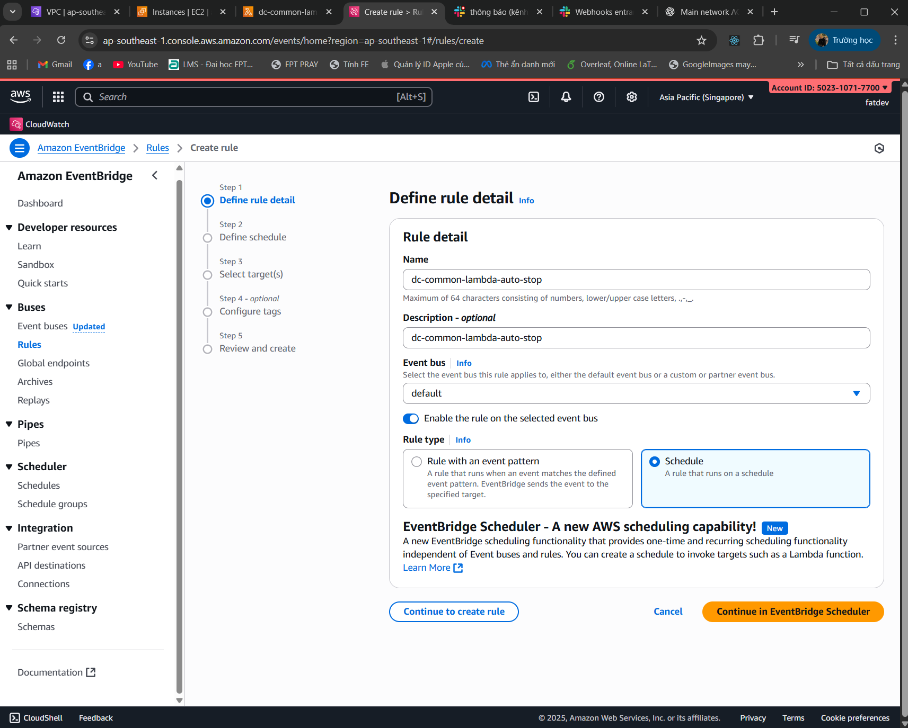

{}
⚠️ **Note:** The following information is for reference purposes only. Please **do not copy verbatim** for your own report, including this warning.
{}

### Week 5 Goals:

In this week, my main goal was to grasp the concepts and services related to security in AWS, including shared responsibility models, access management, encryption, and securing resources. I also became familiar with AWS tools and services to apply them in practical exercises.

The specific goals included:
* Understand the **Share Responsibility Model** of AWS.
* Master key AWS security services: **IAM**, **Cognito**, **Security Hub**, **KMS**, and **Identity Center**.
* Improve skills in managing resources and security through **IAM Permissions Boundary**, **Resource Tags**, and encryption techniques.

### Tasks to be Implemented This Week:

| Day | Task                                                                                                                                                                                                                                                                  | Start Date  | End Date    | Resource Link                                        |
| --- | --------------------------------------------------------------------------------------------------------------------------------------------------------------------------------------------------------------------------------------------------------------------- | ----------- | ----------- | ---------------------------------------------------- |
| 2   | - Learn the theory about the **Share Responsibility Model** and AWS security principles.   - Read documentation on AWS security services:  &emsp;+ **Amazon IAM**  &emsp;+ **Amazon Cognito**  &emsp;+ **AWS Identity Center**  &emsp;+ **AWS KMS**  &emsp;+ **AWS Security Hub**  | 04/10/2025  | 04/10/2025  | [AWS Study Group](https://000013.awsstudygroup.com/)  |
| 3   | - **Practical Exercise:**  &emsp;+ Set up and use **AWS Security Hub** for security monitoring and issue detection.  &emsp;+ Create and manage **IAM Users**, **Roles**, and **Policies** for AWS accounts.  &emsp;+ Create **IAM Groups** and manage access permissions for user groups. | 05/10/2025  | 05/10/2025  | [AWS Study Group](https://000022.awsstudygroup.com/)  |
| 4   | - **Practical Exercise:**  &emsp;+ Optimize **EC2** costs with **Lambda** to automate stopping or starting EC2 instances.  &emsp;+ Manage EC2 access via **Resource Tags** through **IAM**.  &emsp;+ Set up **IAM Permission Boundaries** to limit user permissions.  &emsp;+ Encrypt data with **AWS KMS**. | 06/10/2025  | 06/10/2025  | [AWS Study Group](https://000027.awsstudygroup.com/)  |
| 5   | - **Advanced Practice:**  &emsp;+ Explore and apply security management in **AWS Organizations** for managing multiple AWS accounts.  &emsp;+ Enhance the usage of **AWS Identity Center** to manage and synchronize users and groups across multiple AWS services.                                           | 07/10/2025  | 07/10/2025  | [AWS Study Group](https://000030.awsstudygroup.com/)  |

### Achievements of Week 5:

This week, I achieved significant progress in mastering AWS security services and applying theoretical knowledge into practical tasks. Specifically:

1. **Understanding and Applying the Share Responsibility Model of AWS**:
    - I gained a clear understanding of how AWS shares responsibility with customers for securing infrastructure and applications. This helped me define my role in managing security while deploying services on AWS.

2. **Theoretical Knowledge of Key AWS Security Services**:
    - **Amazon IAM**: Learned how to create and manage **IAM Users**, **Roles**, and **Policies**, helping me control access to resources.
    - **Amazon Cognito**: Explored how to manage user authentication for applications in AWS.
    - **AWS Identity Center**: Investigated how to connect users to AWS services through Identity Center.
    - **AWS Security Hub**: Configured and used it for security monitoring and threat detection.
    - **AWS KMS**: Practiced encrypting data at rest and securing sensitive data with encryption keys.

3. **Practical Application of AWS Security Services**:
    - Successfully set up and configured **AWS Security Hub** to monitor security issues, detecting vulnerabilities early.
    - Configured **IAM Permissions Boundary** to restrict user permissions and ensure minimal access.
    - **Optimizing EC2 Costs with Lambda**: Used Lambda to automate the stopping of idle EC2 instances to reduce costs.
    - Managed EC2 access with **IAM Policies** and **Resource Tags**.

4. **Improved Resource Management and Security Skills**:
    - Created and managed **IAM Groups** and **Policies** to control user access efficiently.
    - Explored **AWS Organizations** for managing multiple AWS accounts and ensuring consistent security policies across the organization.

# LAB PRACTICE

---

## Mục lục
- [Lab 18](#lab-18)
    - [Lab 22](#lab-22)
        - [VPC](#vpc)
        - [EC2](#ec2)
        - [Slack](#slack)
        - [Lambda + EventBridge](#lambda--eventbridge)
        - [Kết quả kiểm thử (Test Result)](#kết-quả-kiểm-thử-test-result)
- [Lab 27](#lab-27)
- [Lab 28](#lab-28)
    - [Vùng (Regions) & EC2](#vùng-regions--ec2)
    - [Thẻ (Tags)](#thẻ-tags)

---

## Lab 18

Hình minh họa:

---

## Lab 22

### VPC

Hình minh họa cấu hình VPC:

- 
- 
- 
- 

### EC2

Hình minh họa cấu hình EC2:

- 
- 

### Slack

> **Lưu ý (UI mới):** Cần chọn lại **kênh (channel)** trong phần cấu hình để lấy đúng **Webhook URL**.

- 
- 
- 

### Lambda + EventBridge

Hình minh họa cấu hình Lambda và EventBridge:

- 
- 
- 
- 
- 
- 
- 

### Kết quả kiểm thử (Test Result)

- 
- 
- 
- 

---

## Lab 27

Hình minh họa:

---

## Lab 28

Hình minh họa:

### Vùng (Regions) & EC2

- EC2 tại **ap-northeast-1 (Tokyo)**  
  ")

- EC2 tại **us-east-1 (North Virginia)**  
  ")

### Thẻ (Tags)

Các cặp key/value mẫu được sử dụng:

| Key  | Value   |
|------|---------|
| Name | Example |
| Team | Beta    |
| Team | Alpha   |
| Team | TEST    |

Minh họa trên giao diện:

- **Name = Example**, **Team = Beta**  
  

- **Name = Example**, **Team = Alpha**  
  

- **Team = TEST**  
  

---

### Conclusion:

In Week 5, I significantly improved my ability to use AWS security and access management tools. These skills form the foundation for implementing security solutions and cost optimization in upcoming AWS projects. The practical exercises helped me consolidate theory and enhance my ability to use AWS in real-world scenarios.

