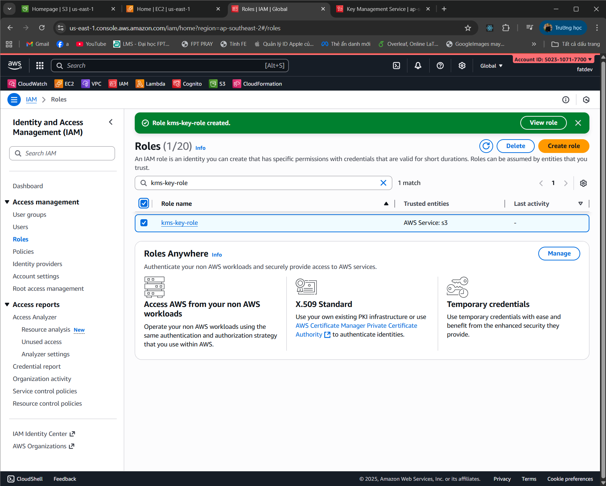

### Week 5 Objectives

This week, my main goal was to master the concepts and security services in AWS, including the shared responsibility model, access management, encryption, and resource protection.  
I also familiarized myself with various AWS tools and services to apply them in hands-on practice.

Specific objectives include:
* Understand the **Shared Responsibility Model** of AWS.
* Master key AWS security services: **IAM**, **Cognito**, **Security Hub**, **KMS**, **Identity Center**.
* Improve resource management and security through **IAM Permissions Boundaries**, **Resource Tags**, and encryption techniques.

---

### Weekly Tasks

| Day | Task                                                                                                                                                                                                                                                        | Start Date | Completion Date | Reference Source                                      |
| --- | ------------------------------------------------------------------------------------------------------------------------------------------------------------------------------------------------------------------------------------------------------------ | ----------- | ---------------- | ----------------------------------------------------- |
| 2   | - Study the theory of the **Shared Responsibility Model** and AWS security principles.   - Review documentation for AWS security services:  &emsp;+ **Amazon IAM**  &emsp;+ **Amazon Cognito**  &emsp;+ **AWS Identity Center**  &emsp;+ **AWS KMS**  &emsp;+ **AWS Security Hub** | 04/10/2025  | 04/10/2025       | [AWS Study Group](https://000013.awsstudygroup.com/)  |
| 3   | - **Hands-on:**  &emsp;+ Configure and use **AWS Security Hub** to monitor and detect security issues.  &emsp;+ Create and manage **IAM Users**, **Roles**, and **Policies** for AWS accounts.  &emsp;+ Create **IAM Groups** and manage access permissions for user groups. | 05/10/2025  | 05/10/2025       | [AWS Study Group](https://000022.awsstudygroup.com/)  |
| 4   | - **Hands-on:**  &emsp;+ Optimize **EC2** costs using **Lambda** for automated start/stop of EC2 instances.  &emsp;+ Manage EC2 access via **Resource Tags** using **IAM**.  &emsp;+ Configure **IAM Permission Boundaries** to limit user privileges.  &emsp;+ Encrypt data using **AWS KMS**. | 06/10/2025  | 06/10/2025       | [AWS Study Group](https://000027.awsstudygroup.com/)  |
| 5   | - **Advanced Practice:**  &emsp;+ Learn and apply security methods in **AWS Organizations** for multi-account management.  &emsp;+ Enhance proficiency in **AWS Identity Center** for managing and synchronizing users and groups across AWS services. | 07/10/2025  | 07/10/2025       | [AWS Study Group](https://000030.awsstudygroup.com/)  |

---

### Results Achieved in Week 5

During this week, I achieved significant progress in understanding and applying AWS security services, effectively bridging theory with practice. Specifically:

1. **Understanding and Applying the AWS Shared Responsibility Model**
    - I fully grasped that AWS is responsible for the security of the cloud infrastructure, while users are responsible for securing their own data and applications.
    - This clarified my role in ensuring compliance and protection when deploying services on AWS.

2. **Theoretical Knowledge of AWS Core Security Services**
    - **Amazon IAM**: Learned how to create and manage **Users**, **Roles**, and **Policies** to control user and group access.
    - **Amazon Cognito**: Studied user management and authentication for AWS applications.
    - **AWS Identity Center**: Understood how to link and manage user access across multiple AWS services.
    - **AWS Security Hub**: Configured and utilized it to monitor and detect security threats.
    - **AWS KMS**: Practiced encrypting data at rest and securing sensitive data using encryption keys.

3. **Practical Implementation of AWS Security Services**
    - Successfully installed and configured **AWS Security Hub** for continuous monitoring and vulnerability detection.
    - Configured **IAM Permissions Boundaries** to restrict user privileges and prevent unauthorized access.
    - **EC2 Cost Optimization with Lambda**: Automated the shutdown of unused EC2 instances to minimize operational costs.
    - **EC2 Access Control via IAM & Resource Tags**: Applied IAM Policies that use **Tags** to precisely define access scope.

4. **Enhanced AWS Resource Management Skills**
    - Created and managed **IAM Groups** and **Policies**, improving group-based access control.
    - Learned how to manage multiple AWS accounts using **AWS Organizations**, ensuring consistent security policies across the organization.

---

# LAB PRACTICE

---

## Table of Contents
- [Lab 18](#lab-18)
    - [Lab 22](#lab-22)
        - [VPC](#vpc)
        - [EC2](#ec2)
        - [Slack](#slack)
        - [Lambda + EventBridge](#lambda--eventbridge)
        - [Test Results](#test-results)
- [Lab 27](#lab-27)
- [Lab 28](#lab-28)
    - [Regions & EC2](#regions--ec2)
    - [Tags](#tags)
- [Lab 30](#lab-30)
- [Lab 33](#lab-33)

---

## Lab 18

Illustration:

---

## Lab 22

### VPC

VPC configuration illustrations:

- 
- 
- 
- 

### EC2

EC2 configuration illustrations:

- 
- 

### Slack

> **Note (New UI):** Re-select the **channel** during setup to get the correct **Webhook URL**.

- 
- 
- 

### Lambda + EventBridge

Lambda and EventBridge configuration illustrations:

- 
- 
- 
- 
- 
- 
- 

### Test Results

- 
- 
- 
- 

---

## Lab 27

Illustrations:

---

## Lab 28

Illustrations:

### Regions & EC2

- EC2 in **ap-northeast-1 (Tokyo)**  
  ")

- EC2 in **us-east-1 (North Virginia)**  
  ")

### Tags

Sample key/value pairs used:

| Key  | Value   |
|------|---------|
| Name | Example |
| Team | Beta    |
| Team | Alpha   |
| Team | TEST    |

Tag interface examples:

- **Name = Example**, **Team = Beta**  
  

- **Name = Example**, **Team = Alpha**  
  

- **Team = TEST**  
  

---

## Lab 30

- **Policies:**

  

- **IAM:**

  

- **Check Permission:**

  

---

## Lab 33

- **Policies**

- **Role**

- **User**

- **KMS**

- **S3**

  
  

- **CloudTrail**

  

- **Athena**

- **Test after applying ACLs**

  
  
  

---

### Conclusion

During Week 5, I significantly improved my ability to use AWS security and access management tools.  
These knowledge and skills form a solid foundation for implementing advanced security solutions and cost optimization in future AWS projects.  
The lab exercises reinforced theoretical understanding and enhanced my practical skills for working effectively in real AWS environments.
