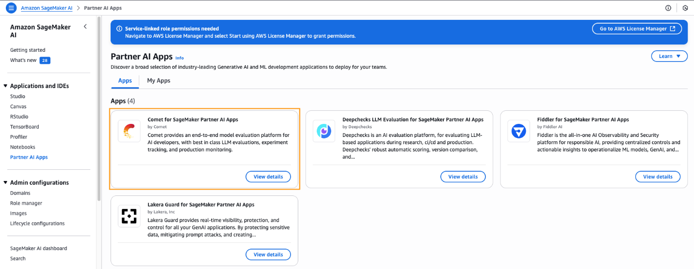
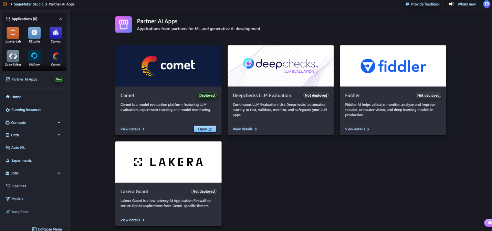

# **Accelerating Enterprise ML Experimentation with Amazon SageMaker AI and Comet**

**By: Vikesh Pandey, Naufal Mir and Sarah Ostermeier -- Date: September 22, 2025\
Topics: Amazon SageMaker AI, SageMaker Unified Studio, Partner solutions, Sarah Ostermeier**

As organizations scale their machine learning (ML) operations from proof-of-concept to production, managing experiments, tracking model lineage, and ensuring reproducibility become significantly more complex. The main reason is that data scientists and ML engineers often experiment with numerous combinations of hyperparameters, model architectures, and dataset versions, generating large amounts of metadata that need to be tracked to ensure reproducibility and regulatory compliance. As ML models scale across multiple teams and regulatory requirements increase, experiment tracking becomes mandatory rather than just a "best practice".

Amazon SageMaker AI provides managed infrastructure for enterprises to scale ML workloads, handling compute provisioning, distributed training, and deployment without worrying about infrastructure. However, teams still need a robust experiment tracking system, model comparison capabilities, and collaboration beyond basic logging.

Comet is a comprehensive ML experiment management platform that automatically tracks, compares, and optimizes ML experiments throughout the model lifecycle. It provides data scientists and ML engineers with powerful tools for tracking, model monitoring, hyperparameter optimization, and collaborative model development. It also includes Opik — Comet's open-source platform for LLM (large language model) observability and development.

Comet is available in SageMaker AI as a Partner AI App, as a fully managed capability for experimentation, with enterprise-grade security, seamless workflow integration, and a simple procurement process through AWS Marketplace.

This combination addresses the needs of end-to-end enterprise ML workflows: SageMaker AI handles infrastructure and compute, while Comet provides the experiment management, model registry, and production monitoring capabilities that teams need for regulatory compliance and operational efficiency. In this article, we demonstrate a complete fraud detection workflow using SageMaker AI + Comet, showcasing the reproducibility and audit-ready logging that modern enterprises require.

## **Making Comet "Enterprise-ready" on SageMaker AI**

Before diving into the deployment guide, organizations need to define their operating model and determine how to deploy Comet. AWS recommends setting up Comet following a federated operating model: Comet is centrally managed in a shared services account, and each ML data team has its own autonomous environment. Each operating model has its own pros and cons. (Refer to SageMaker Studio Administration Best Practices for details).

In this architecture, there are typically two roles:

-   Administrator -- responsible for setting up shared infrastructure and environments for use-case teams

-   User -- ML practitioners from use-case teams who use the established environment to solve business problems

Comet works well with both SageMaker AI and Amazon SageMaker (SageMaker AI uses the integrated environment in SageMaker Studio IDE; SageMaker uses Unified Studio IDE). Here, we use SageMaker Studio in the example.

### **Administrator Journey**

When a team wants to deploy a fraud detection use-case, the admin performs:

1.  Complete the prerequisite steps to set up Partner AI Apps --- grant permissions so Comet can assume the user's SageMaker AI role and manage Comet subscription through AWS Marketplace.\
    > 

2.  In the SageMaker AI console, go to Applications and IDEs → Partner AI Apps → Comet to view details.

    -   Displays subscription details, pricing model, and estimated Comet infrastructure costs.

3.  Select Go to Marketplace to subscribe to Comet from AWS Marketplace.

4.  Select "View purchase options" and fill in the subscription information.

5.  After subscription is complete, the admin begins configuring Comet.

    -   When deploying Comet, add the fraud detection team's project lead as an admin to manage the Comet dashboard.

6.  The Comet deployment process takes a few minutes. (Refer to the Partner AI App provisioning guide for details).

7.  Set up the SageMaker AI domain following the *Use custom setup for Amazon SageMaker AI* guide. As a best practice, provide a pre-signed domain URL so the use-case team can access the Comet UI without logging into the SageMaker console.

8.  Add team members to the domain and enable Comet access when configuring the domain.

After these steps, the SageMaker AI domain is ready for users to log in and begin working.

### **User Journey (ML Practitioner)**

When the environment is ready, the user performs:

1.  Log into the SageMaker AI domain via the pre-signed URL.

    -   Automatically redirects to SageMaker Studio IDE, with username and IAM execution role pre-configured by the admin.

2.  Create a JupyterLab Space following the JupyterLab user guide.

3.  Begin the fraud detection use-case by launching a notebook.

    -   The admin has already granted data access through the necessary S3 buckets.

4.  To use Comet's API, install the comet_ml package and configure environment variables following the *Set up Partner AI Apps SDKs* guide.

5.  In SageMaker Studio, select Partner AI Apps → Open Comet to access the Comet UI.

> 

6.  Begin the experiment workflow.

## **Solution Overview**

This use-case highlights common challenges in enterprises:

-   Imbalanced datasets (e.g., only ~0.17% of transactions are fraudulent)

-   Multiple iteration rounds

-   Requirements for complete reproducibility and audit compliance

-   Data & model lineage must be recorded in detail

Using the Credit Card Fraud Detection dataset, with binary labels --- 1 for fraud, 0 for legitimate. The following steps illustrate the key parts of the implementation (complete code is available in Comet's GitHub repo).

## **Prerequisites**

Configure the imports and Comet + SageMaker environment variables:

\# Comet ML for experiment tracking

import comet_ml

from comet_ml import Experiment, API, Artifact

from comet_ml.integration.sagemaker import log_sagemaker_training_job_v1

AWS_PARTNER_APP_AUTH = True

AWS_PARTNER_APP_ARN = \<Your_AWS_PARTNER_APP_ARN\>

COMET_API_KEY = \<Your_Comet_API_Key\>

COMET_WORKSPACE = '\<your-comet-workspace-name\>'

COMET_PROJECT_NAME = '\<your-comet-project-name\>'

-   The AWS_PARTNER_APP_ARN and COMET_API_KEY variables are obtained from the Comet details page in SageMaker.

-   COMET_WORKSPACE and COMET_PROJECT_NAME are the workspace and project names you will use to group experiments.

## **Preparing the Dataset**

A key feature of Comet is automatic dataset versioning & lineage tracking. This enables full audit trails of which data was used to train each model --- crucial in regulated environments.

Example:

\# Create dataset Artifact to track the original dataset

dataset_artifact = Artifact(

name="fraud-dataset",

artifact_type="dataset",

aliases=["raw"]

)

dataset_artifact.add_remote(s3_data_path, metadata={

"dataset_stage": "raw",

"dataset_split": "not_split",

"preprocessing": "none"

})

-   Artifact allows tagging of dataset files and associated metadata

-   Raw data is added to the artifact for Comet to track the dataset source

## **Starting a Comet Experiment**

After the artifact has been logged, you start an experiment and Comet will automatically record background metadata, environment, libraries, code, etc.

experiment_1 = comet_ml.Experiment(

project_name=COMET_PROJECT_NAME,

workspace=COMET_WORKSPACE,

)

experiment_1.log_artifact(dataset_artifact)

-   Experiment automatically begins recording information

-   log_artifact logs the dataset artifact to the experiment for traceability

## **Data Preprocessing**

Preprocessing steps include:

-   Removing duplicate records

-   Dropping unnecessary columns

-   Splitting data into train/validation/test sets

-   Feature standardization using scikit-learn's StandardScaler

***The preprocessing code is written in the preprocess.py file and run as a SageMaker Processing Job:***

processor = SKLearnProcessor(

framework_version='1.0-1',

role=sagemaker.get_execution_role(),

instance_count=1,

instance_type='ml.t3.medium'

)

processor.run(

code='preprocess.py',

inputs=[ProcessingInput(source=s3_data_path, destination='/opt/ml/processing/input')],

outputs=[ProcessingOutput(source='/opt/ml/processing/output', destination=f's3://{bucket_name}/{processed_data_prefix}')]

)

-   *When the job starts, SageMaker AI creates an instance, processes the data, and then releases the resource.*

-   *Preprocessing results are saved to S3.*

After completion, you create a new version of the dataset artifact to track the processed data:

preprocessed_dataset_artifact = Artifact(

name="fraud-dataset",

artifact_type="dataset",

aliases=["preprocessed"],

metadata={

"description": "Credit card fraud detection dataset",

"fraud_percentage": f"{fraud_percentage:.3f}%",

"dataset_stage": "preprocessed",

"preprocessing": "StandardScaler + train/val/test split",

}

)

preprocessed_dataset_artifact.add_remote(

uri=f's3://{bucket_name}/{processed_data_prefix}',

logical_path='split_data'

)

experiment_1.log_artifact(preprocessed_dataset_artifact)

-   Artifacts with the same name but different aliases allow Comet to manage versioning

-   Additional metadata helps document what was done (split, preprocessing...)

## **Comet + SageMaker AI Experiment Workflow**

To accelerate rapid experimentation, you should organize the workflow into utility functions that can be called multiple times with different hyperparameters while ensuring consistent logging and evaluation.

Key functions:

*train() --- creates an XGBoost training job on SageMaker:*

estimator = Estimator(

image_uri=xgboost_image,

role=execution_role,

instance_count=1,

instance_type='ml.m5.large',

output_path=model_output_path,

sagemaker_session=sagemaker_session_obj,

hyperparameters=hyperparameters_dict,

max_run=1800 \# maximum time (seconds)

)

estimator.fit({

'train': train_channel,

'validation': val_channel

})

-   *log_training_job() --- logs training metadata to Comet and links the model:*

log_sagemaker_training_job_v1(

estimator=training_estimator,

experiment=api_experiment

)

-   *log_model_to_comet() --- logs model artifact to Comet:*

experiment.log_remote_model(

model_name=model_name,

uri=model_artifact_path,

metadata=metadata

)

-   *deploy_and_evaluate_model() --- deploys endpoint and evaluates, logs metrics:*

predictor = estimator.deploy(initial_instance_count=1, instance_type="ml.m5.xlarge")

experiment.log_metrics(metrics)

experiment.log_confusion_matrix(matrix=cm, labels=['Normal', 'Fraud'])

fpr, tpr, _ = roc_curve(y_test, y_pred_prob_as_np_array)

experiment.log_curve("roc_curve", x=fpr, y=tpr)

-   *Complete prediction and evaluation code is available in the GitHub repo.*

## **Running the Experiments**

You can try multiple experiments by calling utility functions with different hyperparameter configurations and comparing results to select the optimal configuration for your use-case.

For example, the first experiment (baseline):

hyperparameters_v1 = {

'objective': 'binary:logistic',

'num_round': 100,

'eval_metric': 'auc',

'learning_rate': 0.15,

'booster': 'gbtree'

}

estimator_1 = train(

model_output_path=f"s3://{bucket_name}/{model_output_prefix}/1",

execution_role=role,

sagemaker_session_obj=sagemaker_session,

hyperparameters_dict=hyperparameters_v1,

train_channel_loc=train_channel_location,

val_channel_loc=validation_channel_location

)

log_training_job(experiment_key = experiment_1.get_key(), training_estimator=estimator_1)

log_model_to_comet(

experiment = experiment_1,

model_name="fraud-detection-xgb-v1",

model_artifact_path=estimator_1.model_data,

metadata=metadata

)

deploy_and_evaluate_model(

experiment=experiment_1,

estimator=estimator_1,

X_test_scaled=X_test_scaled,

y_test=y_test

)

When running a Comet experiment from a Jupyter notebook, you need to call experiment_1.end() to ensure all information is recorded and saved to the Comet server.

After the baseline experiment completes, you can launch the next experiment with different hyperparameters and compare the two experiments in the Comet UI.

## **Viewing Experiments in Comet UI**

To access the UI, you can get the URL from SageMaker Studio IDE or print it from the notebook using experiment_2.url.

Screenshots of the Comet interface show experiments being compared --- these details are for illustration purposes and do not represent actual experiments.

(*Note: insert Comet UI screenshot here*)

## **Clean Up**

Due to the ephemeral nature of SageMaker infrastructure (processing, training) --- it automatically shuts down after the job completes. However, you still need to:

1.  Shut down JupyterLab Space when not in use (following the Idle shutdown guide).

2.  Unsubscribe from Comet if not continuing to use it (to avoid charges) --- the subscription will auto-renew if not cancelled.

## **Benefits of SageMaker + Comet Integration**

### **Streamlined Model Development**

The SageMaker-Comet combination reduces manual burden when running experiments. While SageMaker handles infrastructure provisioning, Comet automatically logs hyperparameters, metrics, code, libraries, system information --- no additional configuration needed.

Comet supports visualization beyond simple metric charts: integrated charts enable quick experiment comparison; custom Python panels help you debug model behavior, optimize hyperparameters, or create custom visuals when default tools don't meet needs.

### **Enterprise Collaboration & Governance**

In enterprise environments, this combination creates a strong foundation for scaling ML projects in heavily regulated environments. SageMaker ensures consistent, secure ML environments; Comet supports collaboration with complete artifact flows and lineage. This helps avoid errors when teams cannot reproduce previous results.

### **Complete ML Lifecycle Integration**

Unlike fragmented solutions that only support training or monitoring, SageMaker + Comet supports the entire ML lifecycle.

-   Models can be registered in Comet's model registry with versioning and management.

-   SageMaker handles deployment.

-   Comet maintains lineage and approval workflow for promotion.

-   Comet monitors model performance and tracks data drift after deployment --- creating a feedback loop where information from production influences subsequent experiments.

## **Conclusion**

In this article, we presented how to integrate SageMaker and Comet to create a fully managed ML environment supporting reproducibility and experiment tracking. To complement your SageMaker workflow, you can deploy Comet directly within the SageMaker environment through AWS Marketplace.

### **About the Authors**

