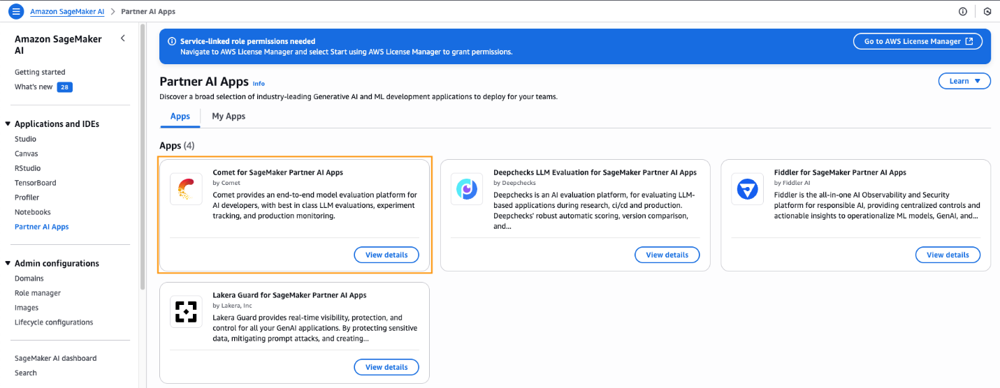
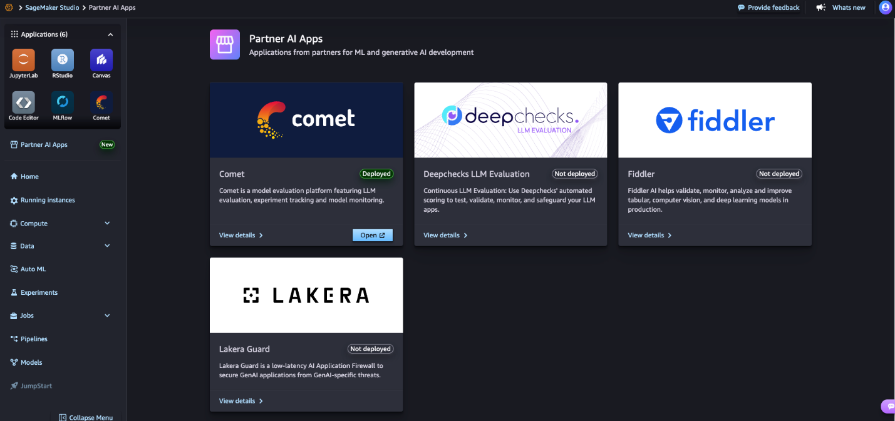

---
title: "Blog 1"
date: 2025-09-10
weight: 1
chapter: false
pre: " <b> 3.1. </b> "
---

# **Thực nghiệm ML nhanh cho doanh nghiệp với Amazon SageMaker AI và Comet**

**Bởi: Vikesh Pandey, Naufal Mir và Sarah Ostermeier -- Ngày: 22/9/2025\
Chủ đề: Amazon SageMaker AI, SageMaker Unified Studio, Partner solutions
,Sarah Ostermeier**

Trong quá trình mở rộng hoạt động machine learning (ML) của doanh nghiệp
từ giai đoạn proof-of-concept sang sản xuất, việc quản lý các thực
nghiệm, theo dõi dòng kế thừa mô hình (model lineage), và đảm bảo tái
tạo kết quả (reproducibility) trở nên phức tạp hơn rất nhiều. Nguyên
nhân chính là các nhà khoa học dữ liệu và kỹ sư ML thường thử nghiệm
nhiều phép kết hợp hyperparameter, kiến trúc mô hình và phiên bản
dataset, sinh ra một lượng metadata lớn cần được theo dõi để đảm bảo khả
năng tái tạo và tuân thủ quy định. Khi quy mô mô hình ML lan rộng qua
nhiều đội, yêu cầu về quy định (regulation) gia tăng, việc theo dõi thực
nghiệm trở thành điều bắt buộc chứ không chỉ là "best practice".

Amazon SageMaker AI cung cấp cơ sở hạ tầng được quản lý để doanh nghiệp
mở rộng workloads ML, xử lý việc cấp phát computer , huấn luyện phân
tán, deployment mà không cần lo hạ tầng. Tuy nhiên, các đội vẫn cần một
hệ thống theo dõi thực nghiệm mạnh mẽ, khả năng so sánh mô hình và hợp
tác vượt lên những logging cơ bản.

Comet là một nền tảng quản lý thực nghiệm ML (ML experiment management)
toàn diện, tự động theo dõi, so sánh và tối ưu các thực nghiệm ML suốt
vòng đời mô hình. Nó cung cấp cho các nhà khoa học dữ liệu và kỹ sư ML
các công cụ mạnh về tracking, monitoring mô hình, tối ưu hyperparameter
và phát triển mô hình hợp tác. Nó cũng có Opik --- nền tảng mã nguồn mở
của Comet cho quan sát và phát triển LLM (large language model).

Comet có sẵn trong SageMaker AI như một Partner AI App, như một khả năng
được quản lý đầy đủ cho thực nghiệm, với bảo mật cấp doanh nghiệp, tích
hợp mượt vào workflow, và quy trình mua đơn giản qua AWS Marketplace.

Sự kết hợp này đáp ứng nhu cầu của quy trình ML doanh nghiệp end-to-end:
SageMaker AI xử lý hạ tầng và compute, Comet cung cấp khả năng quản lý
thực nghiệm, đăng ký mô hình (model registry) và giám sát sản xuất mà
các đội cần cho tuân thủ quy định và hiệu quả vận hành. Trong bài viết
này, chúng tôi minh hoạ một workflow phát hiện gian lận (fraud
detection) hoàn chỉnh dùng SageMaker AI + Comet, minh chứng khả năng tái
tạo và logging sẵn sàng audit mà doanh nghiệp ngày nay cần.

## **Comet "Enterprise-ready" trên SageMaker AI**

Trước khi đi vào hướng dẫn triển khai, các tổ chức cần xác định mô hình
vận hành (operating model) và từ đó quyết định cách triển khai Comet.
AWS khuyến nghị thiết lập Comet theo mô hình liên bang (federated
operating model): Comet được quản lý trung tâm trong tài khoản shared
services, và mỗi đội dữ liệu ML có môi trường tự chủ riêng. Mỗi mô hình
vận hành có lợi --- hại riêng. (Tham khảo SageMaker Studio
Administration Best Practices để biết chi tiết).

Trong kiến trúc này, thường có hai vai:

-   Administrator -- người chịu trách nhiệm thiết lập hạ tầng chung và môi trường cho các đội use-case

-   User (Người dùng) -- nhà thực nghiệm ML từ các đội use-case, sử dụng môi trường đã thiết lập để giải quyết bài toán doanh nghiệp

Comet hoạt động tốt với cả SageMaker AI và Amazon SageMaker (SageMaker
AI dùng môi trường tích hợp trong SageMaker Studio IDE; SageMaker dùng
Unified Studio IDE). Ở đây, chúng ta dùng SageMaker Studio trong ví dụ.

### **Hành trình của Administrator**

Khi một đội muốn triển khai use-case phát hiện gian lận, admin thực
hiện:

1.  Thực hiện các bước prerequisite để thiết lập Partner AI Apps --- cấp phép để Comet có thể giả danh role SageMaker AI của người dùng và quản lý đăng ký Comet qua AWS Marketplace.\

2.  Trong console SageMaker AI, vào phần Applications and IDEs → Partner AI Apps → Comet để xem chi tiết.

    -   Hiển thị chi tiết hợp đồng, mô hình pricing, ước tính chi phí hạ tầng Comet.

3.  Chọn Go to Marketplace để đăng ký Comet từ AWS Marketplace.

4.  Chọn "View purchase options" và điền thông tin đăng ký.

5.  Sau khi đăng ký xong, admin bắt đầu cấu hình Comet.

    -   Khi deploy Comet, thêm project lead của đội phát hiện gian lận làm admin quản lý dashboard Comet.

6.  Quá trình deploy Comet mất vài phút. (Tham khảo hướng dẫn Partner AI App provisioning để biết chi tiết).

7.  Thiết lập domain SageMaker AI theo hướng dẫn *Use custom setup for Amazon SageMaker AI
*. Theo best practice, cung cấp URL domain có pre-signed để đội use-case truy cập Comet UI mà không cần đăng nhập console SageMaker.

8.  Thêm thành viên đội vào domain và bật quyền truy cập Comet khi cấu hình domain.

Sau các bước này, domain SageMaker AI đã sẵn sàng để user đăng nhập và
bắt đầu làm việc.

### **Hành trình của User (nhà ML)**

Khi môi trường đã sẵn sàng, user thực hiện:

1.  Đăng nhập domain SageMaker AI qua URL đã được pre-signed.

    -   Tự động chuyển tới IDE SageMaker Studio, user name và IAM execution role đã được admin cấu hình sẵn.

2.  Tạo một JupyterLab Space theo hướng dẫn JupyterLab user guide.

3.  Bắt đầu làm use-case phát hiện gian lận bằng cách khởi chạy notebook.

    -   Admin đã cấp quyền truy cập dữ liệu qua bucket S3 cần thiết.

4.  Để dùng API của Comet, cài gói comet_ml và cấu hình biến môi trường (environment variables) theo hướng dẫn *Set up Partner AI Apps SDKs*.

5.  Trong SageMaker Studio, chọn Partner AI Apps → Open Comet để truy cập giao diện Comet UI.

> 

6.  Bắt đầu workflow thực nghiệm.

## **Tổng quan giải pháp (Solution overview)**

Use-case này nhấn mạnh các thách thức thường gặp trong doanh nghiệp:

-   Dataset mất cân bằng (ví dụ ở đây chỉ \~0,17% giao dịch là gian lận)

-   Nhiều vòng thực nghiệm (iterations)

-   Yêu cầu tái tạo hoàn chỉnh (reproducibility) và tuân thủ audit

-   Dòng kế thừa dữ liệu & mô hình (lineage) cần được ghi lại chi tiết

Sử dụng dataset Credit Card Fraud Detection, với nhãn nhị phân --- 1 là
gian lận, 0 là hợp lệ. Các bước sau đây minh họa các phần quan trọng của
triển khai (toàn bộ mã có trong repo GitHub của Comet).

## **Prerequisites (Cài đặt trước)**

Cấu hình các import và biến môi trường Comet + SageMaker:

\# Comet ML for experiment tracking

import comet_ml

from comet_ml import Experiment, API, Artifact

from comet_ml.integration.sagemaker import log_sagemaker_training_job_v1

AWS_PARTNER_APP_AUTH = True

AWS_PARTNER_APP_ARN = \<Your_AWS_PARTNER_APP_ARN\>

COMET_API_KEY = \<Your_Comet_API_Key\>

COMET_WORKSPACE = \'\<your-comet-workspace-name\>\'

COMET_PROJECT_NAME = \'\<your-comet-project-name\>\'

-   Biến AWS_PARTNER_APP_ARN và COMET_API_KEY lấy từ trang chi tiết Comet trong SageMaker.

-   COMET_WORKSPACE và COMET_PROJECT_NAME là tên workspace và project bạn sẽ dùng để nhóm các thực nghiệm.

## **Chuẩn bị dataset**

Một tính năng quan trọng của Comet là versioning dataset tự động & theo
dõi lineage. Điều này cho phép audit đầy đủ dữ liệu nào được dùng để
huấn luyện mỗi mô hình --- rất quan trọng trong các môi trường quy định
(regulation).

Ví dụ:

\# Tạo Artifact dataset để theo dõi dataset gốc

dataset_artifact = Artifact(

name=\"fraud-dataset\",

artifact_type=\"dataset\",

aliases=\[\"raw\"\]

)

dataset_artifact.add_remote(s3_data_path, metadata={

\"dataset_stage\": \"raw\",

\"dataset_split\": \"not_split\",

\"preprocessing\": \"none\"

})

-   Artifact cho phép đánh dấu file dataset và metadata kèm theo

-   Dữ liệu gốc được thêm vào artifact để Comet theo dõi nguồn dataset

## **Bắt đầu một experiment Comet**

Sau khi artifact đã được log, bạn bắt đầu một experiment và Comet sẽ tự
động ghi lại metadata nền, environment, thư viện, code, v.v.

experiment_1 = comet_ml.Experiment(

project_name=COMET_PROJECT_NAME,

workspace=COMET_WORKSPACE,

)

experiment_1.log_artifact(dataset_artifact)

-   Experiment tự động bắt đầu ghi thông tin

-   log_artifact để ghi dataset artifact vào experiment cho truy vết

## **Tiền xử lý dữ liệu (Preprocess)**

Các bước tiền xử lý bao gồm:

-   Loại bỏ bản ghi trùng

-   Bỏ các cột không cần thiết

-   Chia dữ liệu thành các tập train/validation/test

-   Chuẩn hoá các đặc trưng (standardization) dùng StandardScaler của scikit-learn

***Mã tiền xử lý được viết trong file preprocess.py và chạy như
SageMaker Processing Job:***

processor = SKLearnProcessor(

framework_version=\'1.0-1\',

role=sagemaker.get_execution_role(),

instance_count=1,

instance_type=\'ml.t3.medium\'

)

processor.run(

code=\'preprocess.py\',

inputs=\[ProcessingInput(source=s3_data_path,
destination=\'/opt/ml/processing/input\')\],

outputs=\[ProcessingOutput(source=\'/opt/ml/processing/output\',
destination=f\'s3://{bucket_name}/{processed_data_prefix}\')\]

)

-   *Khi job bắt đầu, SageMaker AI tạo instance, xử lý dữ liệu, và sau đó giải phóng resource.*

-   *Kết quả tiền xử lý được lưu lên S3.*

Sau khi hoàn tất, bạn tạo phiên bản mới của artifact dataset để theo dõi
dữ liệu đã được xử lý:

preprocessed_dataset_artifact = Artifact(

name=\"fraud-dataset\",

artifact_type=\"dataset\",

aliases=\[\"preprocessed\"\],

metadata={

\"description\": \"Credit card fraud detection dataset\",

\"fraud_percentage\": f\"{fraud_percentage:.3f}%\",

\"dataset_stage\": \"preprocessed\",

\"preprocessing\": \"StandardScaler + train/val/test split\",

}

)

preprocessed_dataset_artifact.add_remote(

uri=f\'s3://{bucket_name}/{processed_data_prefix}\',

logical_path=\'split_data\'

)

experiment_1.log_artifact(preprocessed_dataset_artifact)

-   Artifact cùng tên nhưng alias khác cho phép Comet quản lý versioning

-   Metadata bổ sung giúp ghi chú những gì đã làm (split, preprocessing...)

## **Workflow thực nghiệm Comet + SageMaker AI**

Để thúc đẩy thực nghiệm nhanh, bạn nên tổ chức workflow thành các hàm
tiện ích (utility functions) có thể gọi lại nhiều lần với các
hyperparameters khác nhau mà vẫn đảm bảo logging và đánh giá thống nhất.

Các hàm quan trọng:

*train() --- tạo job huấn luyện XGBoost trên SageMaker:*\
\
estimator = Estimator(

image_uri=xgboost_image,

role=execution_role,

instance_count=1,

instance_type=\'ml.m5.large\',

output_path=model_output_path,

sagemaker_session=sagemaker_session_obj,

hyperparameters=hyperparameters_dict,

max_run=1800 \# thời gian tối đa (giây)

)

estimator.fit({

\'train\': train_channel,

\'validation\': val_channel

})

-   *log_training_job() --- ghi metadata huấn luyện vào Comet và liên kết mô hình:*

\\log_sagemaker_training_job_v1(

estimator=training_estimator,

experiment=api_experiment

)

-   *log_model_to_comet() --- ghi artifact mô hình lên Comet:*

experiment.log_remote_model(

model_name=model_name,

uri=model_artifact_path,

metadata=metadata

)

-   *deploy_and_evaluate_model() --- triển khai endpoint và đánh giá,log metrics:*

predictor = estimator.deploy(initial_instance_count=1,
instance_type=\"ml.m5.xlarge\")

experiment.log_metrics(metrics)

experiment.log_confusion_matrix(matrix=cm, labels=\[\'Normal\',
\'Fraud\'\])

fpr, tpr, \_ = roc_curve(y_test, y_pred_prob_as_np_array)

experiment.log_curve(\"roc_curve\", x=fpr, y=tpr)

-   *Toàn bộ mã dự đoán và đánh giá chi tiết có trong repo GitHub.*

## **Chạy các thực nghiệm (Run the experiments)**

Bạn có thể thử nhiều experiment bằng cách gọi hàm tiện ích với các cấu
hình hyperparameter khác nhau và so sánh kết quả để chọn cấu hình tối ưu
cho use-case.

Ví dụ, experiment đầu tiên (baseline):

hyperparameters_v1 = {

\'objective\': \'binary:logistic\',

\'num_round\': 100,

\'eval_metric\': \'auc\',

\'learning_rate\': 0.15,

\'booster\': \'gbtree\'

}

estimator_1 = train(

model_output_path=f\"s3://{bucket_name}/{model_output_prefix}/1\",

execution_role=role,

sagemaker_session_obj=sagemaker_session,

hyperparameters_dict=hyperparameters_v1,

train_channel_loc=train_channel_location,

val_channel_loc=validation_channel_location

)

log_training_job(experiment_key = experiment_1.get_key(),
training_estimator=estimator_1)

log_model_to_comet(

experiment = experiment_1,

model_name=\"fraud-detection-xgb-v1\",

model_artifact_path=estimator_1.model_data,

metadata=metadata

)

deploy_and_evaluate_model(

experiment=experiment_1,

estimator=estimator_1,

X_test_scaled=X_test_scaled,

y_test=y_test

)

Khi chạy một Comet experiment từ notebook Jupyter, bạn cần gọi
experiment_1.end() để đảm bảo mọi thông tin được ghi lại và lưu trên máy
chủ Comet.

Sau khi experiment baseline hoàn thành, bạn có thể khởi chạy experiment
kế tiếp với hyperparameter khác và so sánh hai experiment trong giao
diện Comet UI.

## **Xem experiment trong giao diện Comet**

Để truy cập UI, bạn có thể lấy URL từ SageMaker Studio IDE hoặc in ra từ
notebook bằng experiment_2.url.\
Ảnh chụp màn hình giao diện Comet cho thấy các experiment được so sánh
--- chi tiết này dùng để minh họa, không đại diện cho experiment thực
tế.

(*Note: chèn ảnh màn hình UI Comet tại đây*)

## **Clean up (Dọn dẹp tài nguyên)**

Do tính chất ephemeral của hạ tầng SageMaker (processing, training) ---
nó tự shut down sau khi job kết thúc. Nhưng bạn vẫn cần:

1.  Tắt JupyterLab Space khi không dùng (theo hướng dẫn Idle shutdown).

2.  Hủy đăng ký Comet nếu không tiếp tục dùng (tránh phí) --- hợp đồng sẽ tự gia hạn nếu không huỷ.

## **Lợi ích của tích hợp SageMaker + Comet**

### **Streamlined model development**

Sự kết hợp SageMaker -- Comet giảm bớt gánh nặng thủ công khi chạy
experiment. Trong khi SageMaker lo cấp phát hạ tầng, Comet tự động
logging hyperparameters, metrics, code, thư viện, thông tin hệ thống ---
không cần cấu hình thêm.\
Comet hỗ trợ trực quan hóa vượt mức đồ thị metric đơn giản: các biểu đồ
tích hợp giúp so sánh experiment nhanh chóng; panels Python tuỳ chỉnh
giúp bạn debug hành vi mô hình, tối ưu hyperparameter, hoặc tạo visual
riêng khi tool mặc định không đáp ứng.

### **Hợp tác doanh nghiệp & quản trị**

Trong môi trường doanh nghiệp, sự kết hợp này tạo ra nền tảng mạnh để mở
rộng dự án ML trong môi trường có quy định nghiêm ngặt. SageMaker đảm
bảo môi trường ML nhất quán, an toàn; Comet hỗ trợ hợp tác với dòng
artifact và lineage hoàn chỉnh. Điều này giúp tránh lỗi khi các đội
không thể tái tạo kết quả trước đó.

### **Tích hợp vòng đời ML hoàn chỉnh**

Khác với các giải pháp rời rạc chỉ hỗ trợ training hay monitoring,
SageMaker + Comet hỗ trợ toàn bộ vòng đời ML.

-   Mô hình có thể được đăng ký trong model registry của Comet với version, quản lý.

-   SageMaker lo deployment.\rkflow phê duyệt promotion.

-   Comet giữ lineage và wo

-   Comet giám sát hiệu suất mô hình, theo dõi drift dữ liệu sau khi deployment 
--- tạo vòng feedback, nơi thông tin từ production ảnh hưởng đến experiment tiếp theo.

## **Kết luận**

Trong bài viết này, chúng tôi đã trình bày cách tích hợp SageMaker và
Comet để tạo môi trường ML được quản lý hoàn chỉnh, hỗ trợ khả năng tái
tạo và theo dõi experiment. Để bổ sung cho workflow SageMaker, bạn có
thể triển khai Comet ngay trong môi trường SageMaker qua AWS
Marketplace.

### **Về các tác giả**

