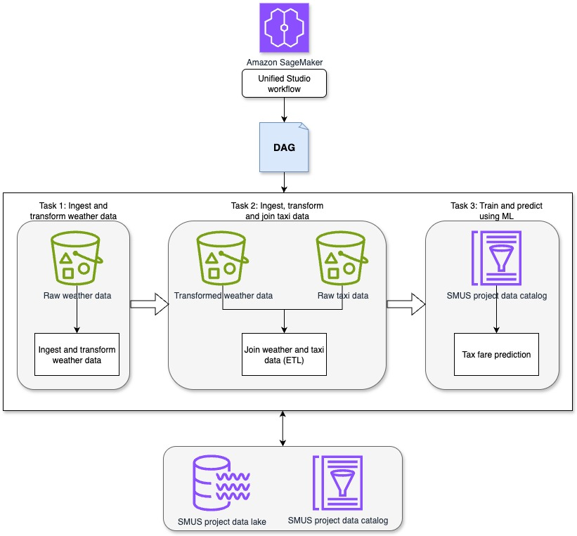
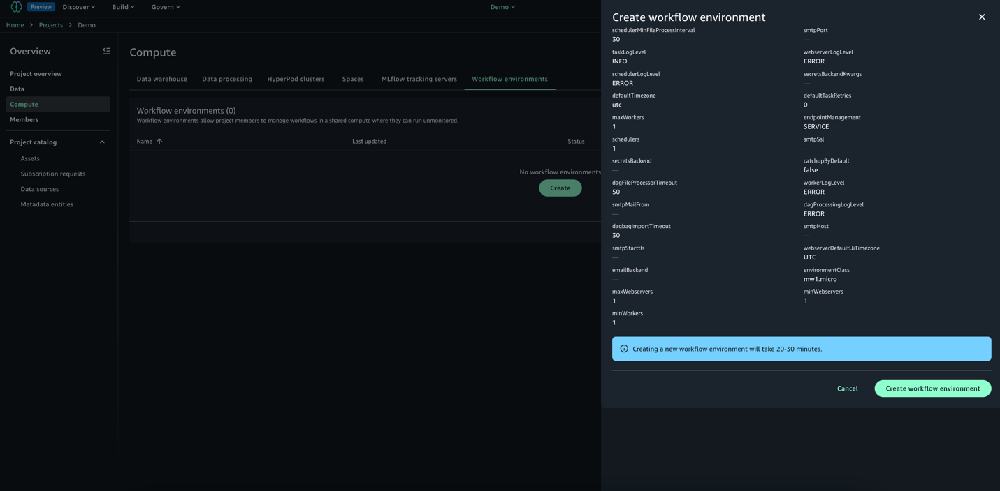
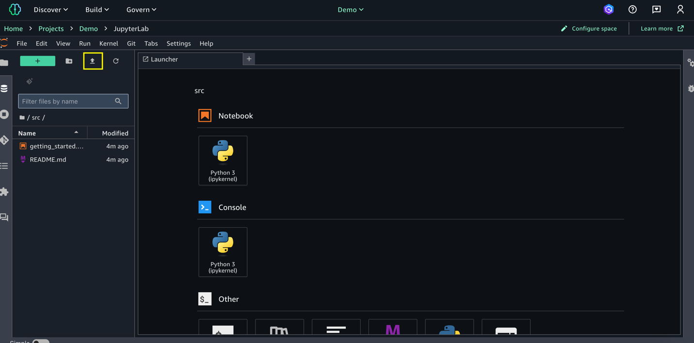
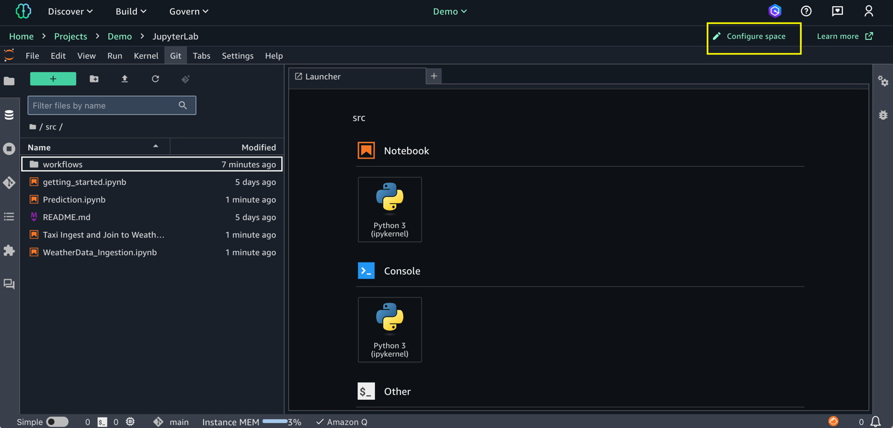
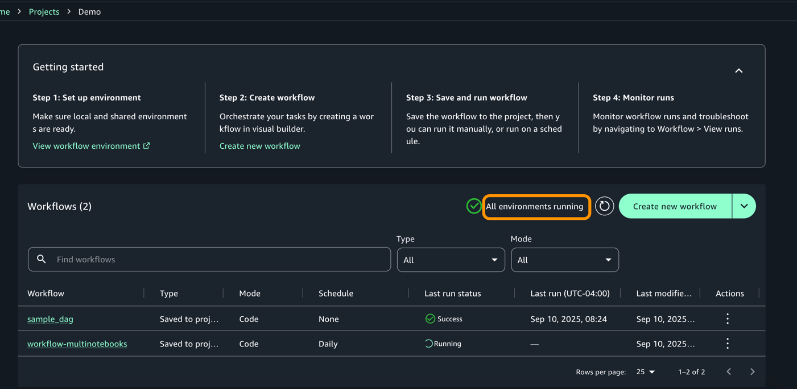
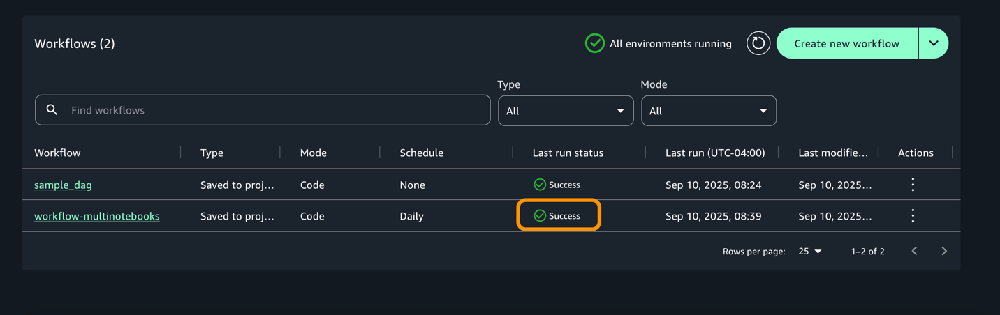
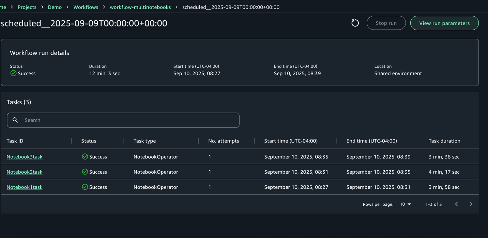
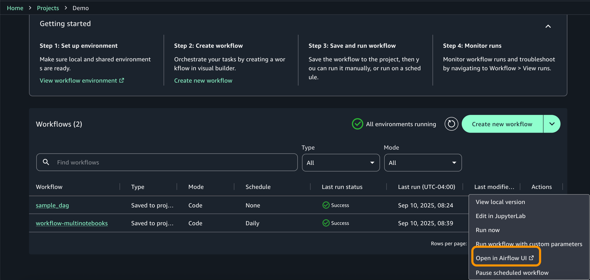
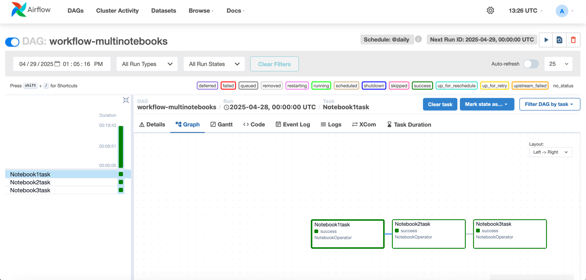

---
title: "Blog 2"
date: 2025-09-10
weight: 1
chapter: false
pre: " <b> 3.2. </b> "
---

# **Using Apache Airflow workflows to orchestrate data processing on Amazon SageMaker Unified Studio**

---

**by Vinod Jayendra, Kamen Sharlandjiev, Sean Bjurstrom, and Suba Palanisamy**

**SEPTEMBER 22, 2025**

---

Orchestrating machine learning pipelines is a complex task, especially when data processing, model training, and deployment are performed across multiple services and tools. In this article, we will walk through a practical "end-to-end" example — building, testing, and running an ML pipeline using SageMaker workflows through the SageMaker Unified Studio interface. These workflows are powered by Amazon Managed Workflows for Apache Airflow (Amazon MWAA).

Although SageMaker Unified Studio has a visual builder (low-code) to create workflows, this article focuses on the code-based approach: writing and managing workflows as DAGs (Directed Acyclic Graphs) using Python in Apache Airflow.

We will examine a pipeline example that includes the following steps: ingesting weather data and taxi data, transforming & merging the data, then using ML to predict taxi fares — all orchestrated through SageMaker Unified Studio workflows.

---

## **Solution overview**

This solution demonstrates how to use workflows in SageMaker Unified Studio to orchestrate a pipeline from data to ML model in a centralized environment. The pipeline consists of the following tasks:

1. Ingest & preprocess weather data  
   Use a notebook in SageMaker Unified Studio to ingest simulated weather data, processing attributes such as time, temperature, rainfall, humidity, and wind speed.

2. Ingest, process, and merge taxi data  
   Use a second notebook to ingest NYC taxi data (including pickup time, drop-off time, distance, passenger count, fare amount). Then process and join the taxi & weather data, saving the results to Amazon S3 for use in the next step.

3. Train and predict ML model  
   A third notebook applies regression techniques to build a model that predicts taxi fares based on the merged data. The model is then used to make predictions on new data.

Through this approach, ETL (extract, transform, load) and ML steps are orchestrated within the same workflow, with full traceability of the data process and ensuring reproducibility through workflow management in SageMaker Unified Studio.

---

## **Prerequisites**

Before building the workflow, you need to:

1. Create a SageMaker Unified Studio domain — follow AWS guidelines.  
   ([Create an Amazon SageMaker Unified Studio domain – quick setup](https://docs.aws.amazon.com/sagemaker-unified-studio/latest/adminguide/create-domain-sagemaker-unified-studio-quick.html))

2. Log in to SageMaker Unified Studio domain — use the domain you created.  
   ([Access Amazon SageMaker Unified Studio](https://docs.aws.amazon.com/sagemaker-unified-studio/latest/userguide/getting-started-access-the-portal.html))

3. Create a project in SageMaker Unified Studio — when creating the project, select the "All capabilities" profile to support full workflow functionality.  
   ([project creation guide](https://docs.aws.amazon.com/sagemaker-unified-studio/latest/userguide/getting-started-create-a-project.html))

---

## **Set up workflow environment**

You can use workflows in SageMaker Unified Studio to set up and run a series of tasks such as notebooks, querybooks, and jobs. Workflows are written in Python code (Airflow DAGs), then you can access the Airflow UI from SageMaker for monitoring.

Specific steps:

1. In your project, go to Compute → Workflow environment.

2. Select Create environment to set up a new workflow environment.

    * By default, SageMaker Unified Studio will use the mw1.micro environment type — suitable for small testing.

    * If needed, you can override the default configuration (e.g., increase resources) when creating the project or adjust in blueprint deployment settings.

---

## **Develop workflows**

Workflows allow you to orchestrate notebooks, querybooks, etc. within the project. You can write Python DAGs, test, and share them with other members.

Example:

1. Download 3 sample notebooks: Weather Data Ingestion, Taxi Ingest & Join, Prediction to your machine.

2. In SageMaker Unified Studio, go to Build → JupyterLab, upload the 3 notebooks.  
   

3. Configure space: stop the current space → change instance type (e.g., ml.m5.8xlarge) → restart space.

4. Go to Build → Orchestration → Workflows, select "Create new workflow" → select "Create in code editor".

In the editor, create a new Python file multinotebook_dag.py in the src/workflows/dags folder. Paste the following example DAG code (modify \<REPLACE-OWNER\> and notebook paths accordingly):

from airflow.decorators import dag  
from airflow.utils.dates import days_ago  
from workflows.airflow.providers.amazon.aws.operators.sagemaker_workflows import NotebookOperator

WORKFLOW_SCHEDULE = '@daily'

NOTEBOOK_PATHS = [  
'\<FULL_PATH/Weather_Data_Ingestion.ipynb\>',  
'\<FULL_PATH/Taxi_Weather_Data_Collection.ipynb\>',  
'\<FULL_PATH/Prediction.ipynb\>'  
]

default_args = {  
'owner': '\<REPLACE-OWNER\>',  
}

@dag(  
dag_id='workflow-multinotebooks',  
default_args=default_args,  
schedule_interval=WORKFLOW_SCHEDULE,  
start_date=days_ago(2),  
is_paused_upon_creation=False,  
tags=['MLPipeline'],  
catchup=False  
)  
def multi_notebook():  
previous_task = None  
for idx, notebook_path in enumerate(NOTEBOOK_PATHS, 1):  
current_task = NotebookOperator(  
task_id=f"Notebook{idx}task",  
input_config={'input_path': notebook_path, 'input_params': {}},  
output_config={'output_formats': ['NOTEBOOK']},  
wait_for_completion=True,  
poll_interval=5  
)

    if previous_task:  
      previous_task >> current_task

    previous_task = current_task

multi_notebook()

5.
    * NotebookOperator is used to run each notebook, with dependencies to ensure execution order.

    * You can customize WORKFLOW_SCHEDULE (e.g., @daily, @hourly, or cron expression).

6. After the workflow environment is created and the DAG file is synced to the project, project members can view and run the shared workflow.

---

## **Test and monitor workflow**

1. Go to Build → Orchestration → Workflows, you will see the workflow running on schedule or triggered.  
   

2. When the workflow completes, the status changes to "success".  
   

3. You can view each execution for details, logs of each task.  
   

4. Access the Airflow UI from SageMaker to view DAGs, run history, detailed logs.  
   
   

---

## **Results & outputs**

The model results are written to the results directory on Amazon S3. You need to check:

* Prediction accuracy

* Consistency in relationships between variables

* If there are anomalous results, review the data processing steps, pipeline, and model assumptions.

---

## **Clean up**

To avoid unnecessary costs, you should delete the created resources:

1. SageMaker Unified Studio domain

2. S3 buckets related to the domain

3. Workflow environments, projects if no longer in use

---

## **Conclusion**

In this article, we demonstrated how you can use SageMaker Unified Studio to build an integrated ML workflow, including:

* Creating a SageMaker Unified Studio project

* Using multi-compute notebooks to process data

* Building a DAG workflow in Python to orchestrate the entire pipeline

* Running and monitoring workflows in SageMaker Unified Studio

SageMaker provides a comprehensive toolset to execute steps from data preparation, model training to deployment. When used through SageMaker Unified Studio, these tools are consolidated in a single working environment, helping eliminate friction between disparate tools.

As organizations build complex data applications, teams can use SageMaker + Unified Studio to collaborate effectively and operate AI/ML with high reliability. You can discover data, build models, and orchestrate workflows in a managed and controlled environment.

---

## **About the authors**

