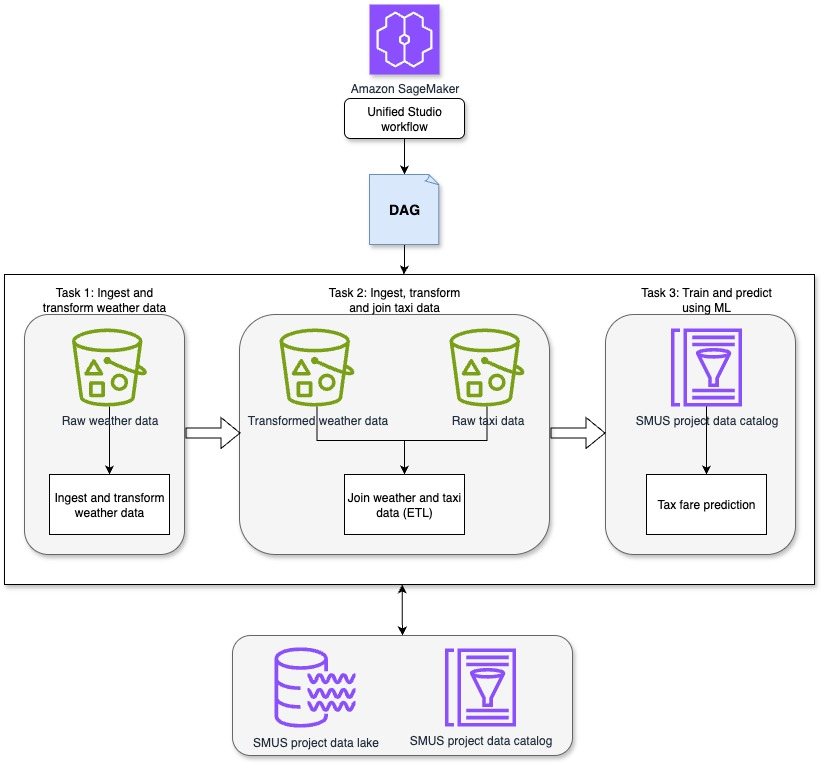
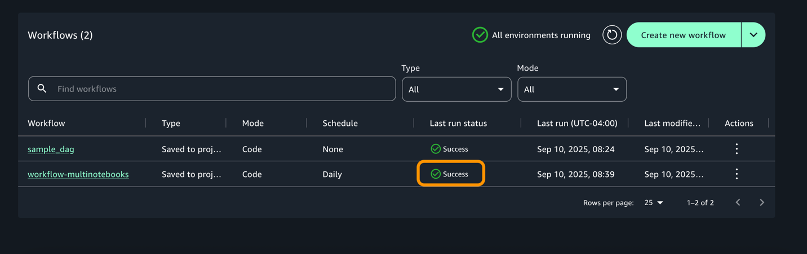
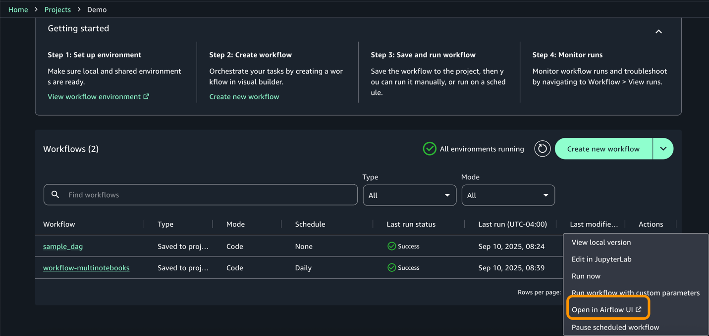

---

# **Sử dụng workflow Apache Airflow để điều phối xử lý dữ liệu trên Amazon SageMaker Unified Studio**

---

**của Vinod Jayendra , Kamen Sharlandjiev , Sean Bjurstrom và Suba Palanisamy**

**22 THÁNG 9 NĂM 2025**

---

Điều phối pipeline machine learning là công việc phức tạp, đặc biệt khi phần xử lý dữ liệu, huấn luyện mô hình và triển khai được thực hiện trên nhiều dịch vụ và công cụ khác nhau. Trong bài viết này, chúng tôi sẽ đi qua ví dụ thực tế “end-to-end” — xây dựng, thử nghiệm và chạy một pipeline ML sử dụng workflow của SageMaker thông qua giao diện SageMaker Unified Studio. Các workflow này được hỗ trợ bởi Amazon Managed Workflows for Apache Airflow (Amazon MWAA).

Mặc dù SageMaker Unified Studio có trình xây dựng trực quan (low-code) để tạo workflow, bài viết này tập trung vào cách làm bằng code: viết và quản lý workflow như các DAG (Directed Acyclic Graph) bằng Python trong Apache Airflow.

Chúng ta sẽ cùng xem ví dụ pipeline gồm các bước: ingest dữ liệu thời tiết và dữ liệu taxi, chuyển đổi & gộp dữ liệu, rồi dùng ML để dự đoán giá cước taxi — toàn bộ được điều phối qua SageMaker Unified Studio workflow.

---

## **Tổng quan giải pháp (Solution overview)**

Giải pháp này minh họa cách dùng workflows trong SageMaker Unified Studio để điều phối pipeline từ dữ liệu đến mô hình ML trong một môi trường tập trung. Pipeline gồm các tác vụ sau:

1. Ingest & tiền xử lý dữ liệu thời tiết  
   Sử dụng notebook trong SageMaker Unified Studio để ingest dữ liệu thời tiết giả lập, xử lý các thuộc tính như thời gian, nhiệt độ, lượng mưa, độ ẩm, tốc độ gió.

2. Ingest, xử lý và hợp nhất dữ liệu taxi  
   Sử dụng notebook thứ hai để ingest dữ liệu taxi NYC (bao gồm pickup time, drop-off time, khoảng cách, số lượng khách, tiền cước). Sau đó xử lý và join dữ liệu taxi & thời tiết, lưu kết quả lên Amazon S3 để dùng cho bước tiếp theo.

3. Huấn luyện và dự đoán mô hình ML  
   Notebook thứ ba áp dụng kỹ thuật hồi quy (regression) để xây dựng mô hình dự đoán giá taxi dựa trên dữ liệu gộp. Mô hình sau đó được dùng để dự đoán giá cho các dữ liệu mới.

Qua cách tiếp cận này, ETL (extract, transform, load) và các bước ML được điều phối trong cùng workflow, với khả năng theo dõi đầy đủ quá trình dữ liệu và đảm bảo tính tái tạo (reproducibility) thông qua workflow quản lý trong SageMaker Unified Studio.

---

## **Chuẩn bị trước (Prerequisites)**

Trước khi xây workflow, bạn cần:

1. Tạo một domain SageMaker Unified Studio — làm theo hướng dẫn của AWS.  
   ( [mục Tạo miền Amazon SageMaker Unified Studio – thiết lập nhanh](https://docs.aws.amazon.com/sagemaker-unified-studio/latest/adminguide/create-domain-sagemaker-unified-studio-quick.html) )

2. Đăng nhập domain SageMaker Unified Studio — dùng domain bạn đã tạo.  
   (  [Truy cập Amazon SageMaker Unified Studio](https://docs.aws.amazon.com/sagemaker-unified-studio/latest/userguide/getting-started-access-the-portal.html) )

3. Tạo một project trong SageMaker Unified Studio — trong phần tạo project, chọn profile “All capabilities” để hỗ trợ đầy đủ công năng workflow.  
   ( [hướng dẫn tạo dự án.](https://docs.aws.amazon.com/sagemaker-unified-studio/latest/userguide/getting-started-create-a-project.html) )

---

## **Thiết lập workflow environment**

Bạn có thể dùng workflow trong SageMaker Unified Studio để thiết lập và chạy chuỗi tác vụ như notebooks, querybooks, jobs. Workflow được viết bằng code Python (Airflow DAG), sau đó bạn có thể truy cập UI Airflow từ SageMaker để theo dõi.

Các bước cụ thể:

1. Trong project của bạn, vào mục Compute → Workflow environment.

2. Chọn Create environment để thiết lập môi trường workflow mới.

    * Theo mặc định, SageMaker Unified Studio sẽ dùng loại môi trường mw1.micro — phù hợp cho thử nghiệm nhỏ.

    * Nếu cần, bạn có thể override cấu hình mặc định (ví dụ tăng tài nguyên) khi tạo project hoặc chỉnh trong blueprint deployment settings.

---

## **Phát triển workflow (Develop workflows)**

Workflow cho phép bạn điều phối notebooks, querybooks, v.v. trong dự án. Bạn có thể viết DAG Python, test và chia sẻ với các thành viên khác.

Ví dụ:

1. Tải 3 notebook mẫu: Weather Data Ingestion, Taxi Ingest & Join, Prediction về máy bạn.

2. Trong SageMaker Unified Studio, vào Build → JupyterLab, upload 3 notebook trên.  
   
3. Cấu hình space: dừng space hiện tại → đổi loại instance (ví dụ ml.m5.8xlarge) → khởi động lại space.

4. Vào Build → Orchestration → Workflows, chọn “Create new workflow” → chọn “Create in code editor”.

Trong editor, tạo file Python mới multinotebook\_dag.py trong thư mục src/workflows/dags. Dán đoạn mã DAG ví dụ sau (sửa \<REPLACE-OWNER\> và các đường dẫn notebook cho phù hợp):

from airflow.decorators import dag  
from airflow.utils.dates import days\_ago  
from workflows.airflow.providers.amazon.aws.operators.sagemaker\_workflows import NotebookOperator

WORKFLOW\_SCHEDULE \= '@daily'

NOTEBOOK\_PATHS \= \[  
'\<FULL\_PATH/Weather\_Data\_Ingestion.ipynb\>',  
'\<FULL\_PATH/Taxi\_Weather\_Data\_Collection.ipynb\>',  
'\<FULL\_PATH/Prediction.ipynb\>'  
\]

default\_args \= {  
'owner': '\<REPLACE-OWNER\>',  
}

@dag(  
dag\_id='workflow-multinotebooks',  
default\_args=default\_args,  
schedule\_interval=WORKFLOW\_SCHEDULE,  
start\_date=days\_ago(2),  
is\_paused\_upon\_creation=False,  
tags=\['MLPipeline'\],  
catchup=False  
)  
def multi\_notebook():  
previous\_task \= None  
for idx, notebook\_path in enumerate(NOTEBOOK\_PATHS, 1):  
current\_task \= NotebookOperator(  
task\_id=f"Notebook{idx}task",  
input\_config={'input\_path': notebook\_path, 'input\_params': {}},  
output\_config={'output\_formats': \['NOTEBOOK'\]},  
wait\_for\_completion=True,  
poll\_interval=5  
)

    if previous\_task:  
      previous\_task \>\> current\_task

    previous\_task \= current\_task

multi\_notebook()

5.
    * NotebookOperator được dùng để chạy từng notebook, với dependencies để đảm bảo thứ tự thực thi.

    * Bạn có thể tùy chỉnh WORKFLOW\_SCHEDULE (ví dụ @daily, @hourly, hoặc cron expression).

6. Sau khi workflow environment được tạo và file DAG được sync vào dự án, các thành viên trong dự án có thể xem và chạy workflow chung.

---

## **Kiểm thử và giám sát workflow**

1. Vào Build → Orchestration → Workflows, bạn sẽ thấy workflow đang chạy theo schedule hoặc được kích hoạt.  
   

2. Khi workflow hoàn thành, trạng thái chuyển sang “success”.  
   

3. Bạn có thể vào từng execution để xem chi tiết, logs từng task.  
   

4. Truy cập Airflow UI từ SageMaker để xem DAGs, lịch sử chạy, logs chi tiết.  
   
   

---

## **Kết quả & đầu ra**

Kết quả của mô hình được ghi ra thư mục kết quả trên Amazon S3. Bạn cần kiểm tra:

* Độ chính xác dự đoán (prediction accuracy)

* Sự nhất quán về quan hệ giữa các biến

* Nếu có kết quả bất thường, cần xem lại bước xử lý dữ liệu, pipeline, giả định mô hình.

---

## **Dọn dẹp tài nguyên (Clean up)**

Để tránh phát sinh chi phí không cần thiết, bạn nên xóa các tài nguyên tạo ra:

1. Domain SageMaker Unified Studio

2. Bucket S3 liên quan tới domain

3. Các workflow environment, project nếu không dùng nữa

---

## **Kết luận**

Trong bài viết này, chúng tôi đã minh họa cách bạn có thể sử dụng SageMaker Unified Studio để xây dựng workflow ML tích hợp, bao gồm:

* Tạo project SageMaker Unified Studio

* Dùng multi-compute notebook để xử lý dữ liệu

* Xây workflow DAG bằng Python để điều phối toàn bộ pipeline

* Chạy, giám sát workflow trong SageMaker Unified Studio

SageMaker cung cấp bộ công cụ toàn diện để thực thi các bước từ chuẩn bị dữ liệu, huấn luyện mô hình đến deployment. Khi sử dụng qua SageMaker Unified Studio, các công cụ này được hợp nhất trong một môi trường làm việc duy nhất, giúp loại bỏ ma sát giữa các công cụ rời rạc.

Khi các tổ chức xây dựng các ứng dụng dữ liệu phức tạp, các đội có thể dùng SageMaker \+ Unified Studio để hợp tác hiệu quả và vận hành AI/ML với độ tin cậy cao. Bạn có thể phát hiện dữ liệu, xây mô hình và điều phối workflow trong một môi trường được quản lý và có kiểm soát.

---

## **Về phần tác giả**

