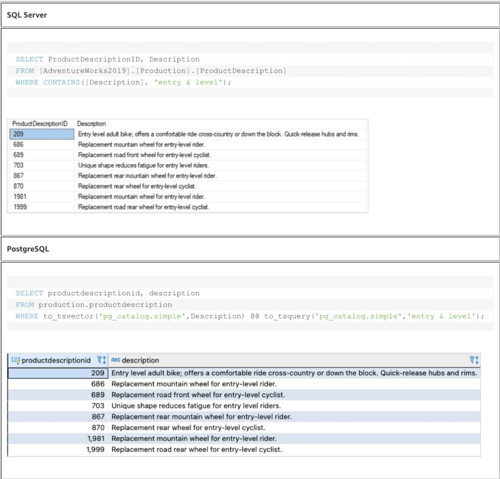
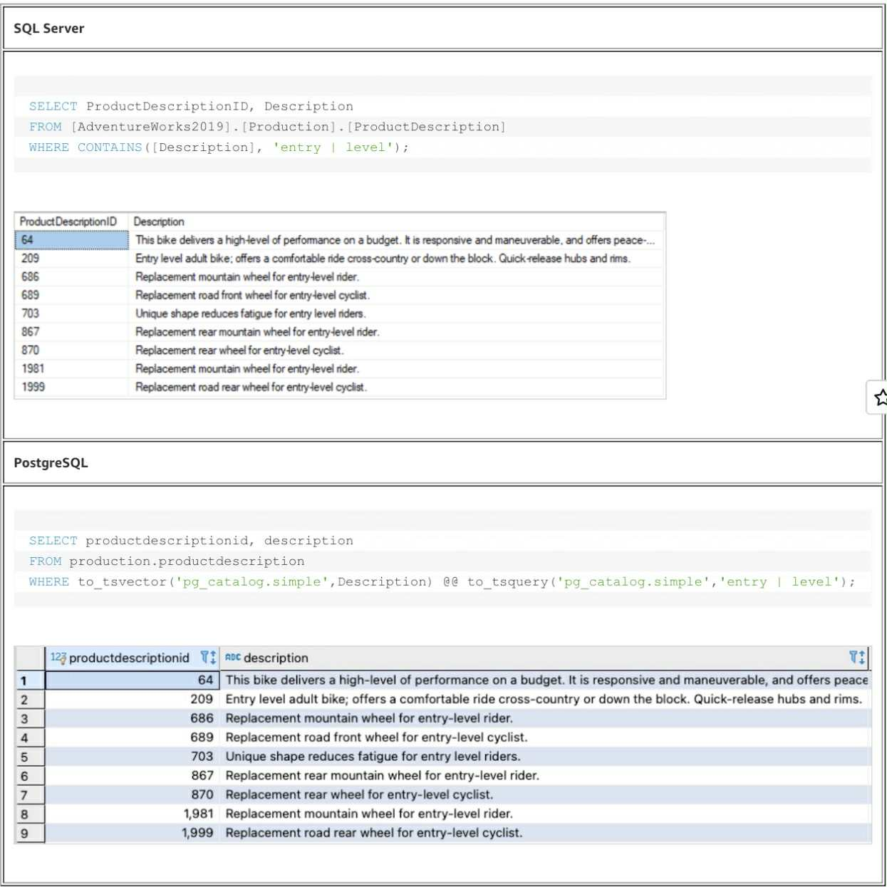
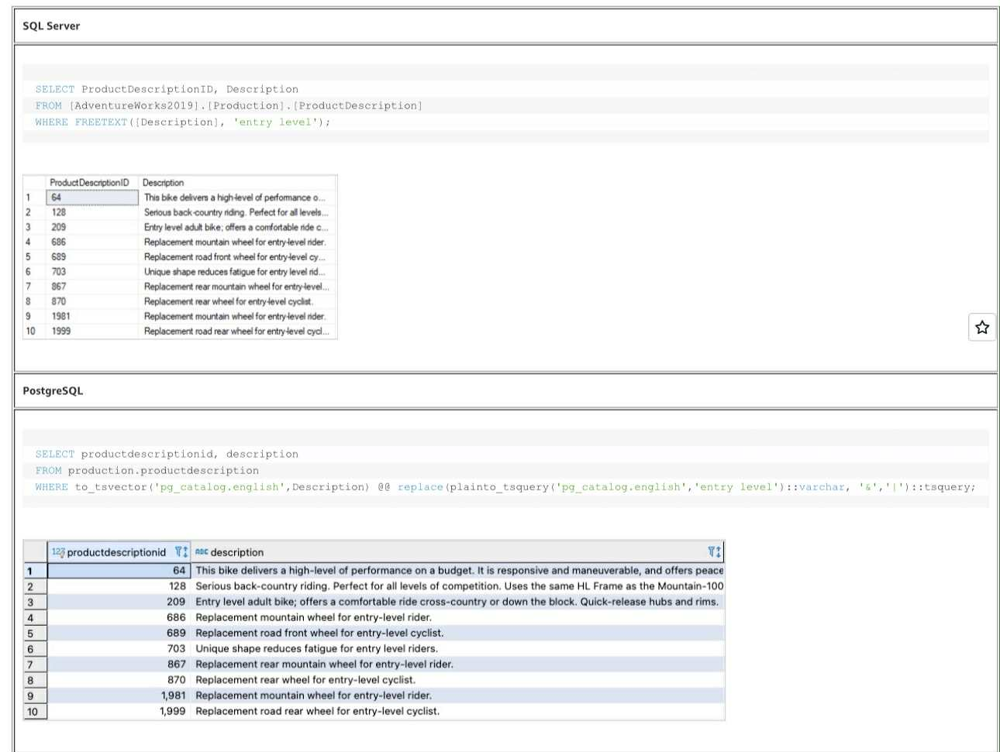
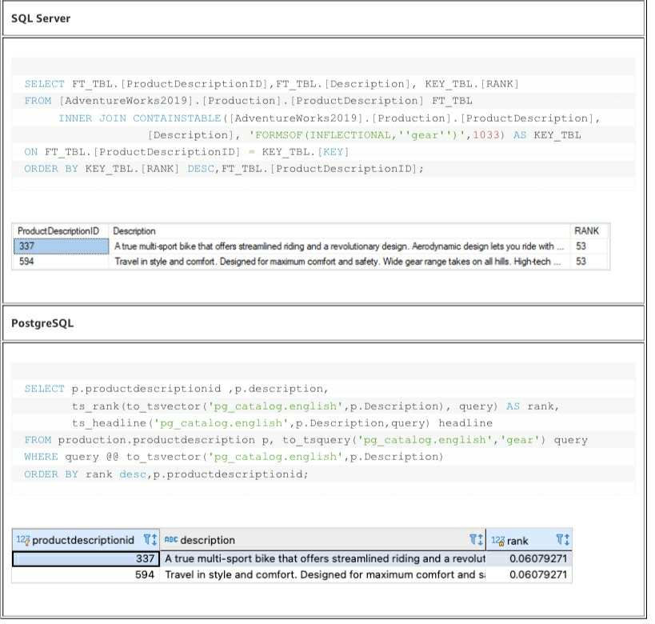
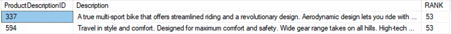
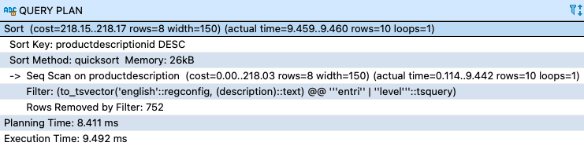
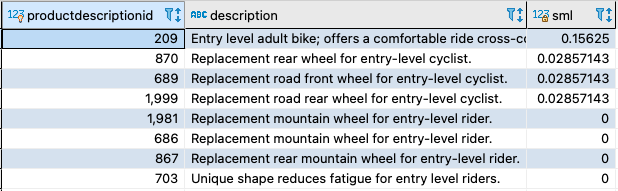

---
title: "Blog 3"
date: 2025-09-10
weight: 1
chapter: false
pre: " <b> 3.3. </b> "
---

# **Migrating full-text search from SQL Server to Amazon Aurora PostgreSQL-Compatible Edition or Amazon RDS for PostgreSQL**

---

Authors: Sivaprasad Appana, Surya Nallu, and Saumitra Das

Published: August 19, 2024

---

In today's data world, the ability to find and retrieve information from large datasets is crucial. While some database management systems (both commercial and open source) excel at handling structured data, PostgreSQL also provides powerful tools for searching unstructured or semi-structured data. PostgreSQL has built-in full-text search (FTS) capabilities, and also supports extensions like pg_trgm and pg_bigm for text search.

Traditional queries using the LIKE, ILIKE operators or regular expressions are well-suited for finding exact strings or structured data, but have limitations when searching within large text fields such as documents, articles, or product descriptions.

When migrating from a commercial database like SQL Server to PostgreSQL (such as Amazon Aurora PostgreSQL-Compatible or Amazon RDS for PostgreSQL), migrating full-text search requires modifying queries and schema structure, as the FTS implementation differs between the two systems. The AWS Schema Conversion Tool (AWS SCT) does not automatically convert full-text search related code.

SQL Server FTS is designed to find words, phrases, or word forms (stemming) in unstructured text data. It supports fast searching, ranking, and text indexing, helping applications efficiently process large amounts of text information.

In this article, we will guide you on how to migrate full-text search from SQL Server to Amazon Aurora PostgreSQL by using the tsvector and tsquery data types. We will also show how to implement FTS using the pg_trgm and pg_bigm extensions.

---

## **Prerequisites**

In this article, we use the AdventureWorks2019 sample database to illustrate how to migrate FTS from SQL Server 2019 Standard to PostgreSQL.

The main steps to set up FTS in SQL Server:

1. Enable full-text search for the AdventureWorks2019 database:

USE [AdventureWorks2019]  
GO  
EXEC sp_fulltext_database 'enable'  
GO

2. Create a full-text catalog:

CREATE FULLTEXT CATALOG DescFTSCatalog;

GO

A full-text catalog is a logical component for managing full-text indexes, defining word breakers and stemmers by language.

3. Define a full-text index for columns containing text data that you want to search:

CREATE FULLTEXT INDEX  
ON  
[AdventureWorks2019].[Production].[ProductDescription]([Description])  
KEY INDEX [PK\_ProductDescription\_ProductDescriptionID]  
ON DescFTSCatalog  
GO

4. Use AWS SCT and AWS Database Migration Service (AWS DMS) to migrate the AdventureWorks 2019 database from SQL Server to Amazon Aurora PostgreSQL. In this article, we migrate the Product Description table.

PostgreSQL has several options for searching text: exact matching, pattern matching, regular expressions, and full-text search. In the following sections, we will guide you on how to use FTS in PostgreSQL on the migrated database to achieve similar results.

## **Full-text search in PostgreSQL**

The LIKE, ILIKE operators and regular expressions are used in the WHERE clause for pattern matching. However, LIKE/ILIKE do not support ranking and typically ignore words such as "the", "is", etc. PostgreSQL provides FTS by using tsvector and tsquery, along with related functions, operators, and parameters.

- tsvector: a data type representing the processed version of text (word tokenization, removal of stop words, reduction to lexemes), optimized for fast text searching. The to_tsvector function converts text to tsvector.

- tsquery: contains one or more lexemes used for searching. Lexemes can be combined with operators to create complex search conditions. The to_tsquery or plainto_tsquery function converts search queries to tsquery.

Example: "He is running in the park" → the words "he", "run", "park" after removing stop words and stemming.

### **CONTAINS predicate with AND operator**

A simple FTS query in SQL Server uses the [CONTAINS](https://learn.microsoft.com/en-us/sql/t-sql/queries/contains-transact-sql?view=sql-server-ver16) predicate. The CONTAINS predicate in Transact-SQL provides a flexible way to perform advanced FTS in SQL Server databases. It supports multiple search conditions, fuzzy searching, wildcards, and thesaurus features, allowing you to customize queries to meet specific requirements.

In the following sample query, the CONTAINS predicate checks for the words "entry" and "level" in the Description column:

SELECT ProductDescriptionID,Description

FROM [AdventureWorks2019].[Production].[ProductDescription]

WHERE CONTAINS([Description], 'entry & level');

### **CONTAINS predicate with OR operator**

This is similar to the previous use case using the CONTAINS predicate, except the check is performed using the OR operator. In the following sample query, the predicate checks for "entry", "level", or both:

SELECT ProductDescriptionID,Description  
FROM [AdventureWorks2019].[Production].[ProductDescription]  
WHERE CONTAINS([Description], 'entry | level');

You can rewrite the query in PostgreSQL by using the to_tsvector and to_tsquery functions as follows and using the default built-in text search dictionary value of pg_catalog.simple.

### **FREETEXT predicate**

The [FREETEXT](https://learn.microsoft.com/en-us/sql/t-sql/queries/freetext-transact-sql?view=sql-server-ver16) predicate in [Transact-SQL](https://learn.microsoft.com/en-us/sql/t-sql/language-reference?view=sql-server-ver16) (T-SQL) is used to perform full-text search in SQL Server databases. Unlike the CONTAINS function, which requires specific terms and conditions, the FREETEXT predicate allows more flexible and natural language-based searching.

In the following sample queries, FREETEXT checks for the words "entry" or "level" and their forms (using inflection) in the Description column:

SELECT ProductDescriptionID, Description  
FROM [AdventureWorks2019].[Production].[Product description]  
WHERE FREETEXT([Description], 'entry level');

You can rewrite the query in PostgreSQL using the to_tsvector and to_tsquery functions as follows with the pg_catalog.english configuration value. This configuration uses english_stem and a simple dictionary to convert tokens to lexemes. Therefore, a lexeme represents a normalized form of a word or token that can be indexed and used for search operations.

### **FREETEXTTABLE function with RANK**

FTS in SQL Server can generate an optional score (or rank value) that represents the relevance of data returned by the full-text query. This rank value is calculated per row and can be used as a sorting criterion to order the query result set by relevance. The rank value only shows the relative relevance order of rows in the result set. The actual value is not important and often differs each time you run the query. The rank value has no meaning between queries.

In the following sample queries, [FREETEXTTABLE](https://learn.microsoft.com/en-us/sql/relational-databases/system-functions/freetexttable-transact-sql?view=sql-server-ver16) checks for the words "entry" or "level" and their forms (using inflection) in the Description column and also retrieves RANK information:

SELECT FT_TBL.[ProductDescriptionID],FT_TBL.[Description], KEY_TBL.[RANK]

FROM [AdventureWorks2019].[Production].[ProductDescription] FT_TBL

INNER JOIN FREETEXTTABLE([AdventureWorks2019].[Production].[ProductDescription], [Description], 'entry OR level',1033) AS KEY_TBL

      ON  FT\_TBL.[ProductDescriptionID] \=KEY\_TBL.[KEY]

ORDER BY KEY_TBL.[RANK] DESC,FT_TBL.[ProductDescriptionID];

In PostgreSQL, the [ts_rank](https://www.postgresql.org/docs/current/textsearch-controls.html#TEXTSEARCH-RANKING) function is used to calculate the relevance rank of search results based on how well they match a specific query. The rank is calculated using a numeric value indicating how well the document matches the search terms in the query.

The [ts_headline](https://www.postgresql.org/docs/current/textsearch-controls.html#TEXTSEARCH-HEADLINE) function is used to create a text summary version of the document, highlighting the most relevant portions that match the specific search query. This function is useful for creating excerpts or search result headlines, providing context to users about why a particular document matches their search. The following screenshot shows the results of the PostgreSQL query headline column created using the ts_headline function.

![][image5]

### **CONTAINSTABLE and FORMSOF functions with RANK**

**The [FORMSOF](<https://learn.microsoft.com/en-us/previous-versions/office/developer/exchange-server-2003/aa123618(v=exchg.65)>) function in SQL Server is used to perform _inflectional search_. Inflectional search involves searching for different forms of a word, such as plural forms, verb tenses, or related word forms. This can help you find relevant documents even when they contain variations of the search term, thus improving search accuracy.**

**In the following sample queries, [CONTAINSTABLE](https://learn.microsoft.com/en-us/sql/relational-databases/system-functions/containstable-transact-sql?view=sql-server-ver16) checks for the word "gear" and its forms (using INFLECTIONAL) in the Description column and also retrieves RANK information:**

**SELECT FT_TBL.[ProductDescriptionID],FT_TBL.[Description], KEY_TBL.[RANK]**

**FROM [AdventureWorks2019].[Production].[ProductDescription] FT_TBL**

    **INNER JOIN CONTAINSTABLE([AdventureWorks2019].[Production].[ProductDescription],**

                             **[Description], 'FORMSOF(INFLECTIONAL,''gear'')',1033)**

**AS KEY_TBL**

**ON FT_TBL.[ProductDescriptionID] \= KEY_TBL.[KEY]**

**ORDER BY KEY_TBL.[RANK] DESC,FT_TBL.[ProductDescriptionID];**

**In PostgreSQL queries, phrases are first broken down into words or tokens, and these words are normalized and classified into root words (lexemes) using the pg_catalog.english FTS configuration. These lexemes will be the same for different forms (inflections) of a word. Therefore, this feature automatically handles inflectional searches.**

| SQL Server                                                                                                                                                                                                                                                                                                                                                                                                                                                  |
| :---------------------------------------------------------------------------------------------------------------------------------------------------------------------------------------------------------------------------------------------------------------------------------------------------------------------------------------------------------------------------------------------------------------------------------------------------------- |
| **SELECT FT_TBL.[ProductDescriptionID],FT_TBL.[Description], KEY_TBL.[RANK] FROM [AdventureWorks2019].[Production].[ProductDescription] FT_TBL INNER JOIN CONTAINSTABLE([AdventureWorks2019].[Production].[ProductDescription], [Description], 'FORMSOF(INFLECTIONAL,''gear'')',1033) AS KEY_TBL ON FT_TBL.[ProductDescriptionID] \= KEY_TBL.[KEY] ORDER BY KEY_TBL.[RANK] DESC,FT_TBL.[ProductDescriptionID]; ![][image6]** |
| **PostgreSQL**                                                                                                                                                                                                                                                                                                                                                                                                                                              |

| **SELECT p.productdescriptionid ,p.description, ts_rank(to_tsvector('pg_catalog.english',p.Description), query) AS rank, ts_headline('pg_catalog.english',p.Description,query) headline FROM production.productdescription p, to_tsquery('pg_catalog.english','gear') query WHERE query @@ to_tsvector('pg_catalog.english',p.Description) ORDER BY rank desc,p.productdescriptionid; **

## **Improving query performance in PostgreSQL**

For the sample PostgreSQL queries shown previously, the to_tsvector function retrieves tsvector values from the Description column in the productdescription table. In the following sections, we will introduce you to various options to improve query performance.

### **Solution 1: Using GIN index**

A GIN (Generalized Inverted Index) in PostgreSQL is a popular indexing method used to efficiently speed up searching for complex data types such as JSON and full-text search. Standard database indexes, a B-tree, are designed to check for equality, while GIN is designed for search patterns that operate on nested or aggregate data structures, allowing more expressive search patterns. By indexing the components of complex data types separately, GIN indexes enable faster queries on arrays, JSON data, and text search operations. This makes GIN indexes a useful tool for improving the performance of queries related to complex data structures in PostgreSQL databases.

[In this approach, you create a GIN index](https://www.postgresql.org/docs/current/gin-intro.html) based on an expression on the column of interest in the product description table.

1. Run the following command:

CREATE INDEX productdescription_gin_idx ON production.productdescription

2. USING GIN (to_tsvector('pg_catalog.english', Description));
3. If the table has millions of rows, you can increase the maintenance_work_mem configuration parameter at the session level to speed up index creation time. maintenance_work_mem specifies the maximum amount of memory in MB that will be used for maintenance operations such as creating INDEX—by default (PostgreSQL), it is 64 MB.
4. Run the following EXPLAIN ANALYZE query:

EXPLAIN ANALYZE

SELECT \* FROM production.productdescription

WHERE to_tsvector('pg_catalog.english', Description) @@ to_tsquery('pg_catalog.english','entry | level')

5. ORDER BY productdescriptionid DESC;

The output shows that a bitmap index scan is being performed on productdescription_gin_index, improving query performance. The following screenshot shows the explain plan before creating the index.

The following screenshot shows the explain plan after creating the index.

In this case, we can see that query performance is improved when using the GIN index. Although generally, using GIN indexes for full-text search in PostgreSQL can help improve performance, you need to be aware of other performance trade-offs, including the time required to build the index and the additional storage space that the index requires.

### **Solution 2: Using stored generated column**

In this approach, you create a computed column description_tsv containing tsvector values from the description column in the table followed by a GIN index on the computed column.

1. Run the following commands:

ALTER TABLE production.productdescription

ADD COLUMN description_tsv tsvector

GENERATED ALWAYS AS (to_tsvector('pg_catalog.english',Description )) STORED;

2. CREATE INDEX productdescription_gin_idx ON production.productdescription USING GIN(description_tsv);
3. Run the following sample EXPLAIN ANALYZE query:

EXPLAIN ANALYZE

SELECT \*

FROM production.productdescription

WHERE description_tsv @@ to_tsquery('pg_catalog.english','entry | level')

4. ORDER BY productdescriptionid DESC;

The output shows that a bitmap index scan is being performed on productdescription_gin_index, in this case demonstrating improved query performance:

## **Full-text search in PostgreSQL using the pg_trgm extension**

In PostgreSQL, the pg_trgm extension is implemented for text search functions using trigrams. A trigram is essentially a set of three consecutive characters extracted from a given string. By using trigrams, users can identify similarity or matches in text patterns within strings by comparing the number of matching trigrams between strings, along with a predefined similarity threshold parameter set before performing the search.

The pg_trgm extension provides operators that can be used to create trigram indexes on text columns in tables that need to be searched. This index enables efficient similarity operations on indexed columns. The extension provides three similarity operators: similarity (%), word_similarity (\<%), and strict_word_similarity (\<\<%). The threshold parameters for the respective operators are pg_trgm.similarity_threshold, pg_trgm.word_similarity_threshold, and pg_trgm.strict_word_similarity_threshold, which can be set to values from 0 (no similarity) to 1 (perfect match). The similarity(), word_similarity(), and strict_word_similarity() functions are used to calculate similarity scores. You can use pg_trgm as in the following code snippet:

1. Run the following command to create the pg_trgm extension:  
   CREATE EXTENSION pg_trgm;
2. Run the following command to create a GIN index on the productdescription column:
3. CREATE INDEX productdescription_trgm_idx ON production.productdescription USING GIN (Description gin_trgm_ops);
4. Run the following command to set the similarity_threshold configuration value to 0.2. The similarity feature will check for common trigrams between two strings and return a value from 0–1.

SET pg_trgm.similarity_threshold \= 0.2;

SET enable_seqscan \= off;

SELECT productdescriptionid, Description, similarity(Description, 'entry level') AS sml

FROM production.product description

WHERE Description % 'entry level'

5. ORDER BY sml DESC, Description;
6. 
7. Run the following command to set the word_similarity_threshold configuration value to 0.6. word_similarity checks for common trigrams between strings at the word level.

SET pg_trgm.word_similarity_threshold \= 0.6;

SET enable_seqscan \= off;

SELECT productdescriptionid, Description, word_similarity('entry level', Description) AS sml

FROM production.productdescription

WHERE 'entry level' \<% Description

8. ORDER BY sml DESC, Description;
9. 
10. Run the following command to set the strict_word_similarity_threshold configuration value to 0.6. strict_word_similarity is similar to word_similarity but it only considers common trigrams when both words are identical.

SET pg_trgm.strict_word_similarity_threshold \= 0.6;

SET enable_seqscan \= off;

SELECT productdescriptionid, Description, strict_word_similarity('aluminum cups and hollow axle', Description) AS sml

FROM production.productdescription

WHERE 'entry level' \<\<% Description

11. ORDER BY sml DESC, Description;
12. 
13. Run the following command to drop the index and enable sequential scan:
14. DROP INDEX production.productdescription_trgm_idx;

## **Full-text search in PostgreSQL using the pg_bigm extension**

The pg_bigm extension in PostgreSQL enhances full-text search capabilities, especially for languages with complex character sets such as Asian languages.

A bigram is a group of two consecutive characters taken from a string. This extension uses a bigram indexing method, which involves dividing text into consecutive character pairs and building an index based on these bigrams. The pg_bigm extension provides the bigm_similarity() function, the bigm similarity operator \= %, and the pg_bigm.similarity_limit threshold parameter. You can use pg_bigm as follows:

1. Run the following command to create the pg_bigm extension. For instructions on creating extensions in Amazon RDS for PostgreSQL, refer to the article [Using PostgreSQL extensions with Amazon RDS for PostgreSQL](https://docs.aws.amazon.com/AmazonRDS/latest/UserGuide/Appendix.PostgreSQL.CommonDBATasks.Extensions.html) .
2. CREATE EXTENSION pg_bigm;
3. Run the following command to create a GIN index on the productdescription column:
4. CREATE INDEX productdescription_bigm_idx ON production.productdescription USING gin (Description gin_bigm_ops);
5. Run the following command to set the similarity_limit configuration value to 0.15. The similarity check finds common bigrams between two strings and returns a value from 0–1.

SET pg_bigm.similarity_limit TO 0.15;

SELECT \*,bigm_similarity(Description, '%entry level%') rank1

FROM production.productdescription

WHERE Description \=% '%entry level%'

6. ORDER BY rank1 DESC;
7. 
8. Run the following command to drop the index and enable sequential scan:

DROP INDEX production.productdescription_bigm_idx;

9. SET enable_seqscan \= on;

## **Conclusion**

In this article, we have guided you on how to migrate FTS from SQL Server to PostgreSQL and compared some common use cases. Migrating full-text search from SQL Server to PostgreSQL requires manual code rewriting. To learn more, please refer to the [limitations of text search features in PostgreSQL](https://www.postgresql.org/docs/13/textsearch-limitations.html) . We have also guided you on how to use the pg_trgm and pg_bigm extensions in PostgreSQL to implement FTS.

###

**About the authors**

![][image15]
