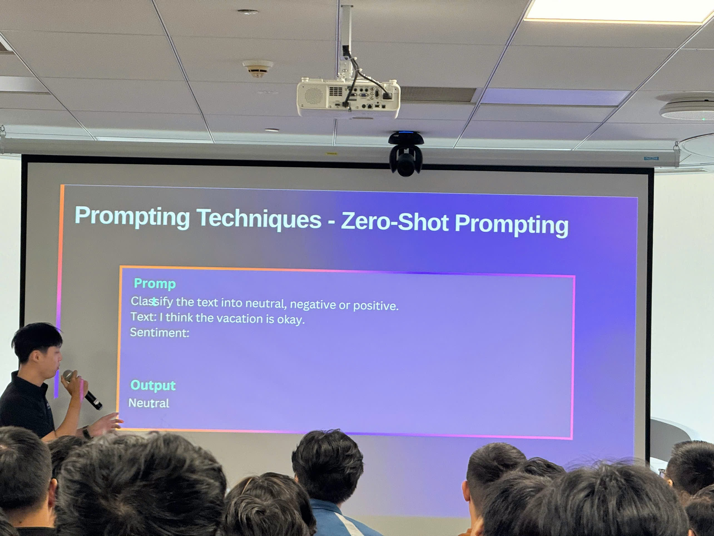
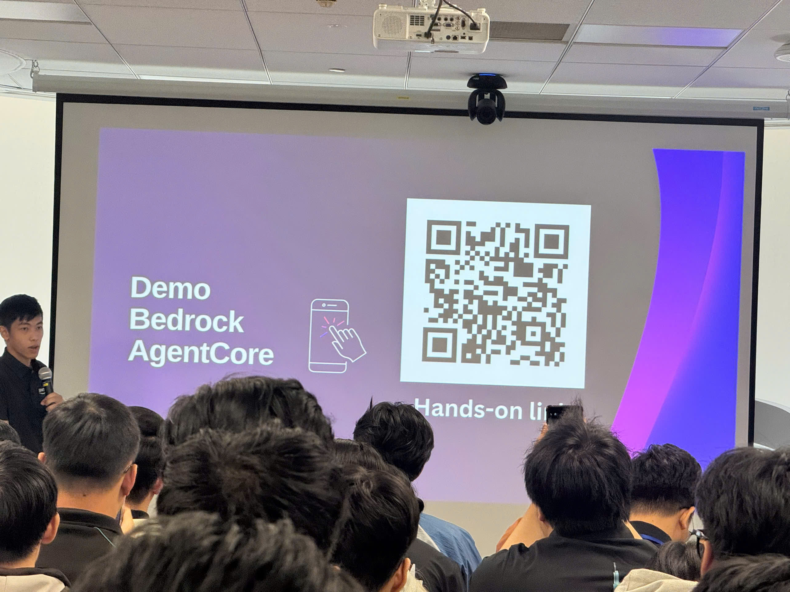
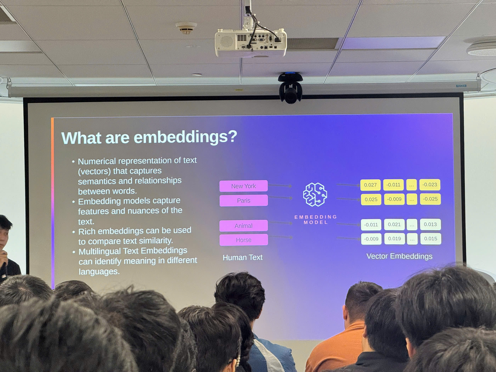
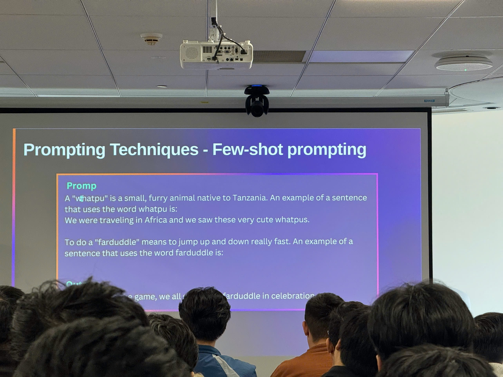

---
title: "Event 1"
date: 2025-09-10
weight: 1
chapter: false
pre: " <b> 4.1. </b> "
---

# Summary Report: "AI/ML/GenAI on AWS"

### Event Objectives

- Provide comprehensive overview of AWS AI/ML services and capabilities
- Introduce Amazon SageMaker as an end-to-end ML platform
- Explore Generative AI with Amazon Bedrock
- Demonstrate practical applications through live demos
- Share best practices for AI/ML implementation in Vietnam

### Event Details

- **Date**: Saturday, November 15, 2025
- **Time**: 8:30 AM – 12:00 PM
- **Location**: AWS Vietnam Office
- **Duration**: 3.5 hours (excluding lunch break)

### Agenda

#### 8:30 – 9:00 AM | Welcome & Introduction

- Participant registration and networking
- Workshop overview and learning objectives
- Ice-breaker activity
- Overview of the AI/ML landscape in Vietnam

#### 9:00 – 10:30 AM | AWS AI/ML Services Overview

- **Amazon SageMaker** – End-to-end ML platform
  - Data preparation and labeling
  - Model training, tuning, and deployment
  - Integrated MLOps capabilities
- **Live Demo**: SageMaker Studio walkthrough

#### 10:30 – 10:45 AM | Coffee Break

#### 10:45 AM – 12:00 PM | Generative AI with Amazon Bedrock

- **Foundation Models**: Claude, Llama, Titan – comparison & selection guide
- **Prompt Engineering**: Techniques, Chain-of-Thought reasoning, Few-shot learning
- **Retrieval-Augmented Generation (RAG)**: Architecture & Knowledge Base integration
- **Bedrock Agents**: Multi-step workflows and tool integrations
- **Guardrails**: Safety and content filtering
- **Live Demo**: Building a Generative AI chatbot using Bedrock

### Key Highlights

#### Amazon SageMaker Platform

- **Comprehensive ML Platform**: Complete solution for building, training, and deploying machine learning models
- **Data Preparation**: Tools for data labeling, feature engineering, and data validation
- **Model Training**: Support for various ML frameworks and algorithms with distributed training capabilities
- **Model Deployment**: Flexible deployment options including real-time inference, batch processing, and serverless inference
- **MLOps Integration**: Built-in capabilities for model monitoring, versioning, and automated workflows

#### Generative AI with Amazon Bedrock

- **Foundation Model Selection**: Understanding differences between Claude, Llama, and Titan models
  - **Claude**: Strong reasoning and conversation capabilities
  - **Llama**: Open-source models with good performance
  - **Titan**: AWS-developed models optimized for specific use cases
- **Prompt Engineering Techniques**:
  - Chain-of-Thought reasoning for complex problem solving
  - Few-shot learning with examples
  - Context management and prompt optimization
- **RAG Architecture**: Combining retrieval with generation for accurate, context-aware responses
  - Knowledge base integration
  - Vector embeddings and similarity search
  - Document chunking strategies
- **Bedrock Agents**: Autonomous agents that can perform multi-step tasks
  - Tool integrations and API calling
  - Workflow orchestration
  - Decision-making capabilities
- **Guardrails for AI Safety**: Content filtering and safety controls
  - Harmful content detection
  - Custom policy configurations
  - Compliance and governance

#### AI/ML Landscape in Vietnam

- Current adoption trends and opportunities
- Use cases specific to Vietnamese market
- Challenges and solutions for local businesses
- Success stories and case studies

### Key Takeaways

#### Machine Learning Best Practices

- **End-to-end Platform Approach**: Use SageMaker for complete ML lifecycle management
- **Data Quality First**: Invest in data preparation and labeling for better model performance
- **MLOps Integration**: Implement monitoring and automated workflows from the start
- **Model Selection Strategy**: Choose the right model based on use case, not just performance metrics

#### Generative AI Implementation

- **Foundation Model Selection**: Understand strengths of each model (Claude, Llama, Titan) for different scenarios
- **Prompt Engineering Mastery**: Chain-of-Thought and Few-shot learning significantly improve results
- **RAG for Accuracy**: Use RAG architecture when factual accuracy is critical
- **Agent Design**: Build agents that can handle multi-step workflows with proper tool integration
- **Safety First**: Always implement guardrails for content filtering and compliance

#### Production Readiness

- **Start Small, Scale Gradually**: Begin with pilot projects before full deployment
- **Cost Optimization**: Monitor and optimize inference costs with serverless options
- **Security & Compliance**: Implement proper access controls and data privacy measures
- **Continuous Improvement**: Monitor model performance and iterate based on real-world feedback

### Applying to Work

- **Explore SageMaker**: Start with SageMaker Studio for ML experimentation and model development
- **Implement RAG Solutions**: Build knowledge bases for domain-specific applications using RAG architecture
- **Develop Bedrock Agents**: Create autonomous agents for customer service or workflow automation
- **Prompt Engineering Practice**: Apply Chain-of-Thought and Few-shot techniques to improve AI responses
- **Deploy Guardrails**: Implement content filtering and safety controls for production GenAI applications
- **MLOps Setup**: Establish model monitoring and automated deployment pipelines using SageMaker capabilities

### Event Experience

Attending the **"AI/ML/GenAI on AWS"** workshop was an exceptional learning experience that provided comprehensive insights into AWS's AI and machine learning capabilities. The event combined theoretical knowledge with practical demonstrations, giving me a clear understanding of how to implement AI/ML solutions on AWS.

#### Learning from comprehensive agenda

- The structured agenda covered everything from foundational ML concepts to advanced Generative AI implementations.
- Starting with SageMaker platform overview helped me understand the complete ML lifecycle before diving into GenAI specifics.
- The progression from traditional ML to Generative AI showed the evolution and complementary nature of these technologies.

#### Hands-on technical exposure

- The **SageMaker Studio walkthrough** demonstrated the practical workflow of building ML models, from data preparation to deployment.
- I learned about **data labeling** tools and how they can significantly improve model accuracy with proper data quality.
- The **MLOps capabilities** showed me how to implement continuous integration and monitoring for ML models in production.

#### Generative AI deep dive

- The **Amazon Bedrock session** was eye-opening, showing me how to leverage foundation models without training them from scratch.
- **Prompt Engineering techniques** like Chain-of-Thought reasoning and Few-shot learning were demonstrated with practical examples.
- Learning about **RAG architecture** helped me understand how to build accurate AI applications that combine retrieval with generation.
- The **Bedrock Agents demo** showed how to build autonomous AI systems that can perform complex multi-step tasks.

#### Practical demonstrations

- The live demo of building a **Generative AI chatbot** using Bedrock gave me a complete picture of implementation from start to finish.
- Seeing **Guardrails in action** demonstrated the importance of safety and content filtering in production GenAI applications.
- The comparison between Claude, Llama, and Titan models helped me understand when to use each model.

#### Networking and discussions

- The workshop provided excellent networking opportunities with other AI/ML enthusiasts and practitioners in Vietnam.
- Discussing **AI/ML landscape in Vietnam** gave me context-specific insights into local market opportunities and challenges.
- Sharing experiences with peers helped me understand real-world implementation challenges and solutions.

#### Lessons learned

- **SageMaker provides a complete platform** that simplifies the entire ML lifecycle, from data preparation to deployment.
- **Foundation models in Bedrock** eliminate the need to train large models from scratch, significantly reducing time and cost.
- **RAG architecture is crucial** for building accurate GenAI applications that need to reference specific knowledge bases.
- **Prompt engineering is a skill** that requires practice and understanding of different techniques for optimal results.
- **Guardrails are essential** for production GenAI applications to ensure safety and compliance.

#### Some event photos

> Overall, this workshop provided me with both foundational knowledge and practical skills needed to implement AI/ML and Generative AI solutions on AWS. The combination of comprehensive platform overview, detailed GenAI capabilities, and hands-on demonstrations gave me confidence to start building AI-powered applications.
