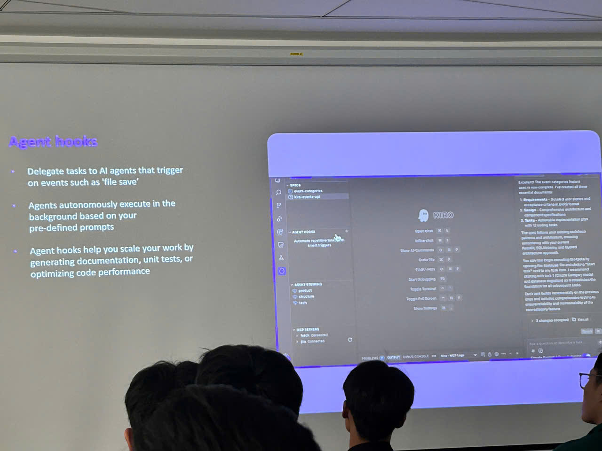
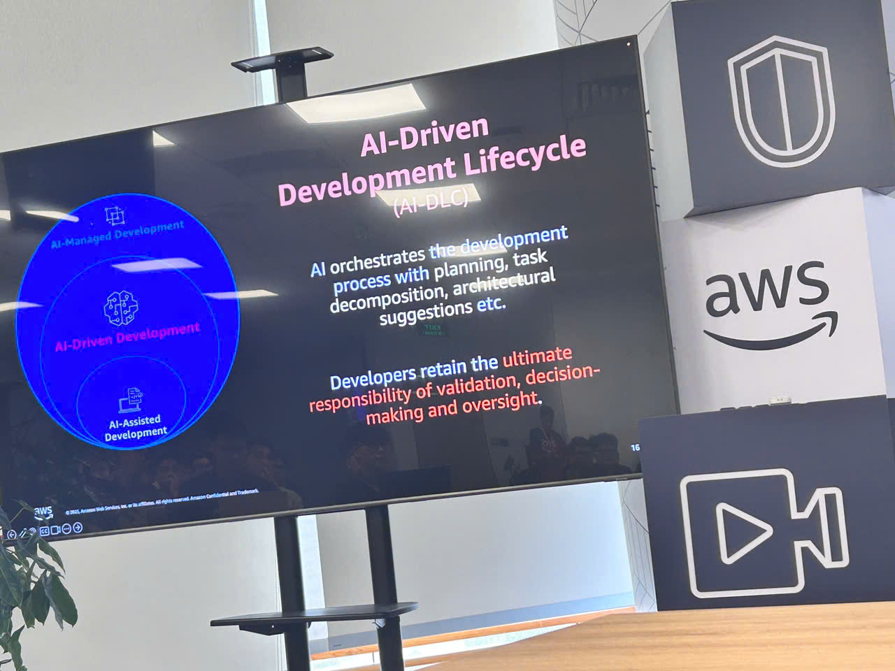
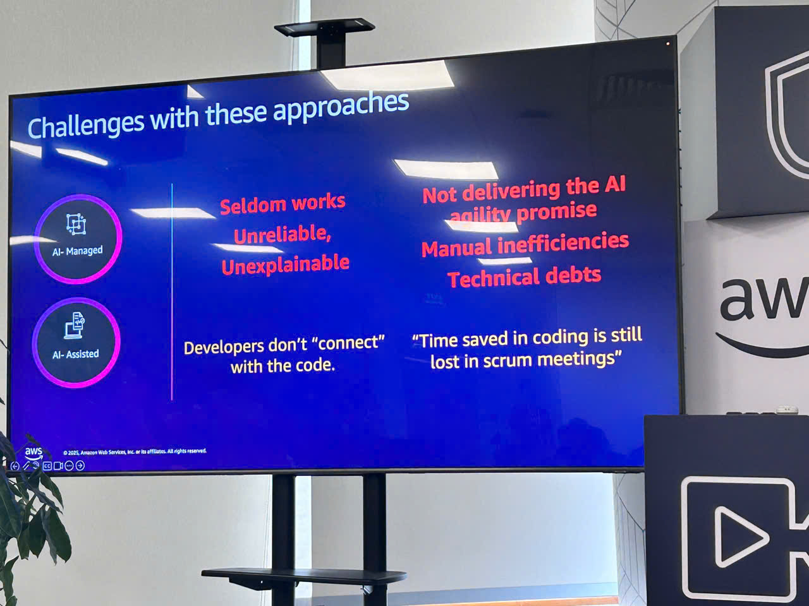

---
title: "Event 1"
date: 2025-09-10
weight: 1
chapter: false
pre: " <b> 4.11. </b> "
---

# Bài thu hoạch "AI-Driven Development Life Cycle: Reimagining Software Engineering"

### Mục Đích Của Sự Kiện

- Tìm hiểu tác động biến đổi của generative AI trong phát triển phần mềm
- Hiểu cách tích hợp AI vào vòng đời phát triển phần mềm (SDLC)
- Giới thiệu các công cụ AI để tự động hóa tác vụ phát triển: Amazon Q Developer và Kiro
- Học cách tận dụng AI để tăng năng suất và tập trung vào công việc có giá trị cao

### Diễn Giả & Tổ Chức

**Giảng viên:**

- **Toan Huynh** – Tổng quan về AI-Driven Development Life Cycle và trình diễn Amazon Q Developer
- **My Nguyen** – Trình diễn Kiro

**Điều phối viên:**

- **Diem My**
- **Dai Truong**
- **Dinh Nguyen**

### Chi Tiết Sự Kiện

- **Ngày**: Thứ Sáu, 3 tháng 10 năm 2025
- **Thời gian**: 14:00 – 16:30
- **Địa điểm**: AWS Event Hall, Tầng 26, Tòa nhà Bitexco, thành phố Hồ Chí Minh
- **Thời lượng**: 2.5 giờ

### Chương Trình

- **14:00 - 14:15**: Đón tiếp
- **14:15 - 15:30**: Tổng quan về AI-Driven Development Life Cycle và trình diễn Amazon Q Developer (bởi Toan Huynh)
- **15:30 - 15:45**: Nghỉ giải lao
- **15:45 - 16:30**: Trình diễn Kiro (bởi My Nguyen)

### Nội Dung Nổi Bật

#### Sự Nổi Lên Của Generative AI Trong Phát Triển Phần Mềm

- **Sự biến đổi**: Generative AI tái tưởng tượng cách các nhà phát triển và tổ chức học hỏi, lập kế hoạch, tạo ra, triển khai và quản lý ứng dụng một cách an toàn
- **Tích hợp SDLC**: AI có thể được tích hợp vào toàn bộ vòng đời phát triển phần mềm: kiến trúc, phát triển, kiểm thử, triển khai và bảo trì
- **Lợi ích tự động hóa**: Tự động hóa các tác vụ nặng không phân biệt, cho phép các nhà phát triển tập trung vào công việc có giá trị cao và sáng tạo hơn
- **Tăng năng suất**: Tăng năng suất đồng thời cho phép các nhà phát triển tập trung vào giải quyết vấn đề sáng tạo và đổi mới

#### AI-Driven Development Life Cycle

- **Bao phủ end-to-end**: Từ lập kế hoạch kiến trúc ban đầu thông qua phát triển, kiểm thử, triển khai và bảo trì liên tục
- **Biến đổi workflow**: Cách các công cụ AI định hình lại các workflow phát triển truyền thống
- **Best practices**: Hướng dẫn để tích hợp AI hiệu quả vào quy trình phát triển hiện có

#### Amazon Q Developer

- **Hỗ trợ SDLC**: Công cụ AI toàn diện hỗ trợ toàn bộ vòng đời phát triển phần mềm
- **Khả năng chính**: Hỗ trợ tạo mã, gỡ lỗi, kiểm thử, tài liệu hóa và refactoring
- **Tích hợp**: Tích hợp mượt mà với các IDE và môi trường phát triển phổ biến
- **Trình diễn thực tế**: Ví dụ thực tế về sử dụng Amazon Q Developer để tăng tốc tác vụ phát triển

#### Kiro

- **AI-powered development**: Giới thiệu Kiro như một trợ lý phát triển AI
- **Use cases**: Các tình huống cụ thể nơi Kiro nâng cao năng suất của nhà phát triển
- **Tính năng**: Các tính năng và khả năng chính được trình diễn trong phiên
- **Trải nghiệm thực hành**: Trình diễn thực tế về Kiro trong hành động

### Những Gì Học Được

#### Chiến Lược Tích Hợp AI

- **Áp dụng dần dần**: Bắt đầu với các use case cụ thể và mở rộng dần việc tích hợp công cụ AI
- **Đảm bảo chất lượng**: Công cụ AI hỗ trợ nhưng giám sát và xem xét của con người vẫn quan trọng
- **Đường cong học tập**: Hiểu các công cụ AI cần thời gian và thực hành để tối đa hóa lợi ích
- **Hợp tác nhóm**: AI nâng cao năng suất nhóm nhưng đòi hỏi workflow và hướng dẫn rõ ràng

#### Nâng Cao Workflow Phát Triển

- **Tác vụ tự động**: Xác định các tác vụ lặp đi lặp lại, giá trị thấp có thể được tự động hóa bằng AI
- **Chất lượng mã**: Sử dụng AI cho code review, kiểm thử và tài liệu để duy trì tiêu chuẩn cao
- **Tăng tốc**: Tận dụng AI để tăng tốc chu kỳ phát triển mà không hy sinh chất lượng
- **Học tập liên tục**: Công cụ AI phát triển nhanh chóng—cập nhật các tính năng và best practices mới

#### Năng Suất Và Tập Trung

- **Tạo giá trị**: Giải phóng các nhà phát triển khỏi các tác vụ thường ngày để tập trung vào giải quyết vấn đề phức tạp và đổi mới
- **Tiết kiệm thời gian**: Tiết kiệm thời gian đáng kể trong viết mã, gỡ lỗi và tài liệu hóa
- **Bổ sung kiến thức**: Công cụ AI giúp thu hẹp khoảng cách kiến thức và cung cấp hỗ trợ theo ngữ cảnh
- **Khả năng mở rộng**: AI cho phép các nhóm xử lý các dự án lớn hơn với cùng tài nguyên

### Ứng Dụng Vào Công Việc

- **Tích hợp Amazon Q Developer**: Bắt đầu sử dụng nó trong các tác vụ phát triển hàng ngày để tạo mã và hỗ trợ
- **Khám phá Kiro**: Đánh giá Kiro cho các use case cụ thể trong workflow phát triển của bạn
- **Thiết lập AI workflows**: Xác định hướng dẫn về khi nào và cách sử dụng công cụ AI trong các dự án nhóm
- **Đo lường năng suất**: Theo dõi cải thiện về tốc độ phát triển và chất lượng mã sau khi áp dụng công cụ AI
- **Chia sẻ học hỏi**: Tài liệu hóa best practices và chia sẻ kinh nghiệm với các thành viên nhóm
- **Cập nhật liên tục**: Theo dõi cập nhật cho các công cụ phát triển AI và tích hợp các tính năng mới khi chúng có sẵn

### Kết Quả Hoặc Giá Trị Đạt Được

Tham gia sự kiện này mang lại giá trị đáng kể thông qua kiến thức mới, kỹ năng và hiểu biết thực tế có thể áp dụng trực tiếp vào các dự án hiện tại và tương lai.

#### Kiến Thức Mới Thu Được

**Khái Niệm AI-Driven Development:**

- Hiểu biết sâu sắc về cách **generative AI** biến đổi vòng đời phát triển phần mềm từ lập kế hoạch đến bảo trì
- Kiến thức toàn diện về tích hợp công cụ AI vào các giai đoạn khác nhau: thiết kế kiến trúc, tạo mã, kiểm thử, triển khai và giám sát liên tục
- Hiểu biết về **best practices** cho phát triển hỗ trợ AI, bao gồm khi nào nên tận dụng AI và khi nào phán đoán con người là quan trọng

**Chuyên Môn Amazon Q Developer:**

- Kiến thức thực tế về sử dụng **Amazon Q Developer** cho tạo mã, gỡ lỗi, tài liệu hóa và refactoring
- Hiểu cách tích hợp Amazon Q Developer với các IDE và môi trường phát triển hiện có
- Học về các khả năng cụ thể: gợi ý mã thông minh, hỗ trợ kiểm thử tự động, và cải thiện chất lượng mã

**Hiểu Biết Nền Tảng Kiro:**

- Khám phá **Kiro** như một trợ lý phát triển AI và các tính năng độc đáo của nó
- Kiến thức về các use case cụ thể nơi Kiro có thể nâng cao năng suất của nhà phát triển
- Hiểu cách Kiro bổ sung cho các công cụ phát triển AI khác trong workflow

#### Kỹ Năng Mới Phát Triển

**Tích Hợp Công Cụ AI:**

- **Kỹ năng**: Khả năng xác định cơ hội tự động hóa AI trong các workflow phát triển
- **Kỹ năng**: Thành thạo trong tích hợp công cụ AI như Amazon Q Developer vào các tác vụ phát triển hàng ngày
- **Kỹ năng**: Khả năng đánh giá và lựa chọn công cụ AI phù hợp cho nhu cầu dự án cụ thể

**Nâng Cao Workflow Phát Triển:**

- **Kỹ năng**: Cải thiện khả năng tự động hóa các tác vụ lập trình lặp đi lặp lại mà vẫn duy trì chất lượng mã
- **Kỹ năng**: Nâng cao khả năng code review bằng phân tích hỗ trợ AI
- **Kỹ năng**: Thực hành tài liệu hóa tốt hơn thông qua tạo tài liệu bằng AI

**Giải Quyết Vấn Đề Hỗ Trợ AI:**

- **Kỹ năng**: Tận dụng AI cho gỡ lỗi và xử lý sự cố phức tạp
- **Kỹ năng**: Sử dụng gợi ý AI để cải thiện hiệu quả mã và best practices
- **Kỹ năng**: Cân bằng hỗ trợ AI với xem xét và phán đoán quan trọng của con người

#### Bài Học Rút Ra

**Hiểu Biết Thực Tế:**

- Công cụ AI là **bộ nhân năng suất** mạnh mẽ nhưng đòi hỏi hiểu biết và tích hợp workflow phù hợp
- Chiến lược **áp dụng dần dần** hiệu quả hơn việc cố gắng tích hợp tất cả công cụ AI cùng một lúc
- **Giám sát con người** vẫn cần thiết—AI hỗ trợ nhưng không thay thế chuyên môn và phán đoán của nhà phát triển
- Đo lường cải thiện năng suất và chất lượng mã giúp biện minh cho việc áp dụng công cụ AI

**Hiểu Biết Chiến Lược:**

- Tích hợp AI thành công đòi hỏi **sự đồng nhất nhóm** và hướng dẫn rõ ràng về cách sử dụng
- Công cụ AI phát triển nhanh chóng—**cập nhật liên tục** với tính năng mới tối đa hóa giá trị lâu dài
- Xác định đúng use case là quan trọng—không phải tất cả tác vụ phát triển đều hưởng lợi như nhau từ hỗ trợ AI
- Chất lượng mã thực sự có thể cải thiện với công cụ AI khi được sử dụng một cách có suy nghĩ và được xem xét đúng cách

#### Đóng Góp Cho Nhóm/Dự Án

**Chia Sẻ Kiến Thức:**

- **Tài liệu hóa**: Tạo ghi chú và tài liệu về best practices từ sự kiện để chia sẻ với các thành viên nhóm
- **Trình bày**: Chuẩn bị chia sẻ hiểu biết về Amazon Q Developer và Kiro với nhóm phát triển
- **Hướng dẫn**: Phát triển hướng dẫn ban đầu để tích hợp công cụ AI vào workflow nhóm

**Ứng Dụng Thực Tế:**

- **Dự án thí điểm**: Xác định các dự án cụ thể nơi công cụ AI có thể được thí điểm để đạt được lợi ích năng suất ngay lập tức
- **Cải thiện workflow**: Đề xuất tích hợp Amazon Q Developer cho code review và tác vụ tài liệu hóa
- **Đào tạo**: Lập kế hoạch tổ chức các phiên nội bộ về thực hành phát triển dựa trên AI cho nhóm

**Giá Trị Dài Hạn:**

- **Lợi thế cạnh tranh**: Có được kiến thức giúp nhóm tận dụng các công cụ phát triển AI tiên tiến
- **Cải thiện hiệu quả**: Dự kiến cải thiện 20-30% tốc độ phát triển cho các tác vụ lặp đi lặp lại bằng công cụ AI
- **Nâng cao chất lượng**: Tiềm năng cải thiện chất lượng mã thông qua xem xét hỗ trợ AI và gợi ý best practices
- **Đổi mới**: Khả năng mới cho phép nhóm giải quyết các vấn đề phức tạp hơn bằng cách giao phó công việc thường ngày cho AI

#### Phát Triển Cá Nhân

**Phát Triển Kỹ Thuật:**

- Mở rộng hiểu biết về thực hành phát triển phần mềm hiện đại với tích hợp AI
- Phát triển quan điểm tư duy tiến bộ về sự tiến hóa của kỹ thuật phần mềm
- Nâng cao khả năng đánh giá và áp dụng công nghệ mới hiệu quả

**Phát Triển Nghề Nghiệp:**

- Tăng tự tin trong làm việc với công cụ phát triển AI
- Cải thiện khả năng giao tiếp khái niệm kỹ thuật cho cả đối tượng kỹ thuật và phi kỹ thuật
- Tăng cường kết nối mạng với các nhà phát triển khác quan tâm đến phát triển dựa trên AI

### Trải nghiệm trong event

Tham gia phiên **"AI-Driven Development Life Cycle: Reimagining Software Engineering"** là một trải nghiệm mở mang tầm mắt, cung cấp những hiểu biết sâu sắc về cách generative AI đang biến đổi phát triển phần mềm. Các trải nghiệm chính bao gồm:

#### Hiểu về sự biến đổi AI

- Học cách **generative AI** đánh dấu sự thay đổi biến đổi trong thực hành phát triển phần mềm.
- Hiểu biết về tích hợp AI vào toàn bộ **SDLC**: kiến trúc, phát triển, kiểm thử, triển khai và bảo trì.
- Hiểu cách tự động hóa AI cho phép các nhà phát triển tập trung vào **các tác vụ sáng tạo có giá trị cao hơn**.

#### Trình diễn công cụ thực hành

- Chứng kiến **Amazon Q Developer** trong hành động, xem cách nó có thể hỗ trợ tạo mã, gỡ lỗi và tài liệu hóa.
- Khám phá **Kiro** như một trợ lý phát triển AI và tìm hiểu về các khả năng và use case cụ thể của nó.
- Xem các ví dụ thực tế về cách các công cụ này **tăng tốc phát triển** đồng thời duy trì chất lượng mã.

#### Học tập thực tế

- Học về **best practices** để tích hợp công cụ AI vào các workflow phát triển hiện có.
- Hiểu tầm quan trọng của **giám sát con người** và đảm bảo chất lượng khi sử dụng công cụ AI.
- Hiểu biết về **xác định cơ hội** cho tự động hóa AI trong quy trình phát triển.

#### Kết nối và thảo luận

- Kết nối với các nhà phát triển khác quan tâm đến phát triển dựa trên AI.
- Trao đổi ý tưởng về **ứng dụng thực tế** của công cụ AI trong các dự án thực tế.
- Thảo luận về thách thức và cơ hội trong việc áp dụng công cụ phát triển AI.

#### Bài học rút ra

- Công cụ AI là trợ lý mạnh mẽ nhưng **phán đoán và xem xét của con người** vẫn cần thiết cho mã chất lượng.
- Tích hợp AI thành công đòi hỏi **áp dụng dần dần** và đào tạo nhóm.
- Công cụ AI phù hợp có thể **tăng năng suất** đáng kể và giải phóng các nhà phát triển cho công việc sáng tạo hơn.
- Cập nhật với sự tiến hóa của công cụ AI là rất quan trọng để **tối đa hóa lợi ích**.

#### Một số hình ảnh khi tham gia sự kiện

> Tổng thể, sự kiện này mở mang tầm mắt về tiềm năng của phát triển dựa trên AI và cung cấp hướng dẫn thực tế về cách tận dụng những công cụ mạnh mẽ này để nâng cao năng suất, cải thiện chất lượng mã và tập trung vào công việc có giá trị cao trong kỹ thuật phần mềm.
