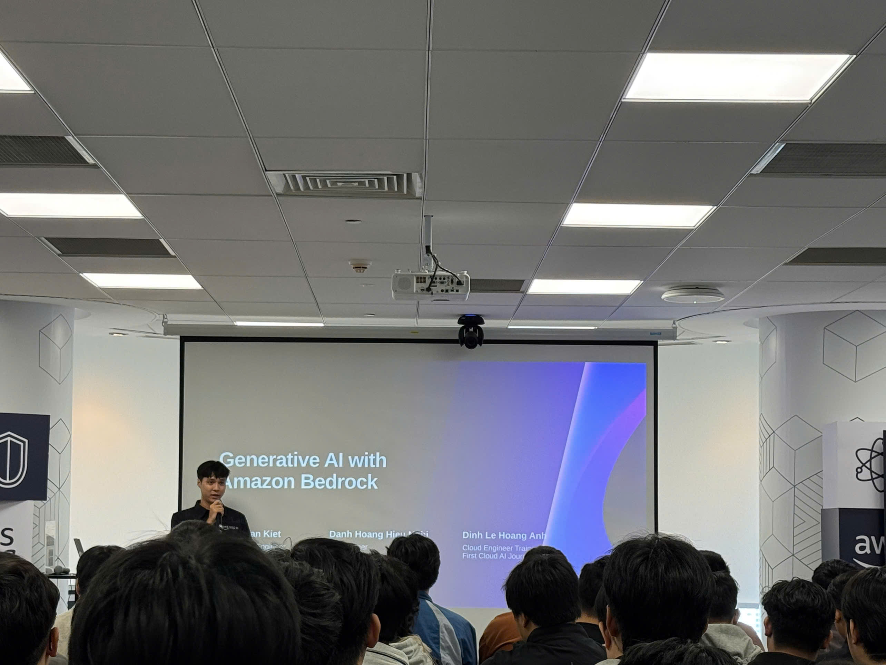
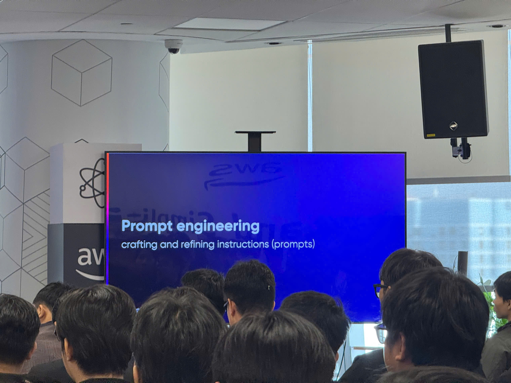
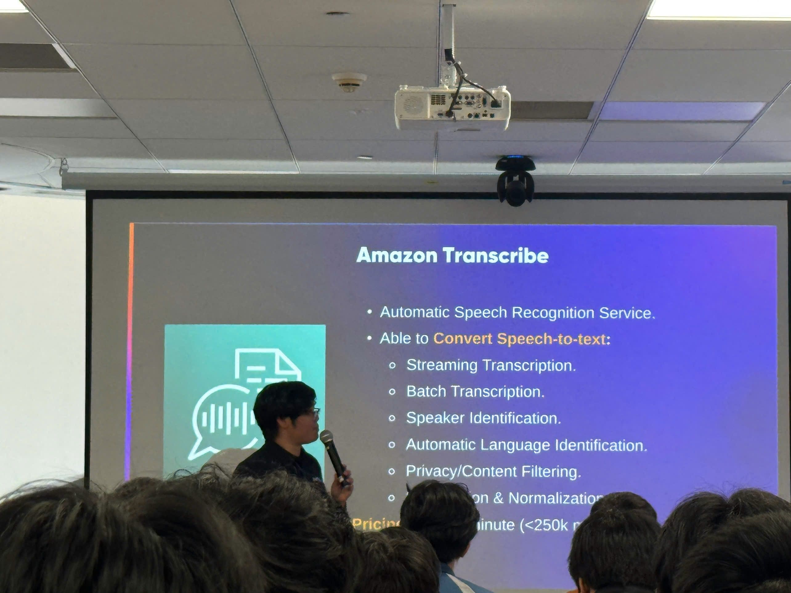
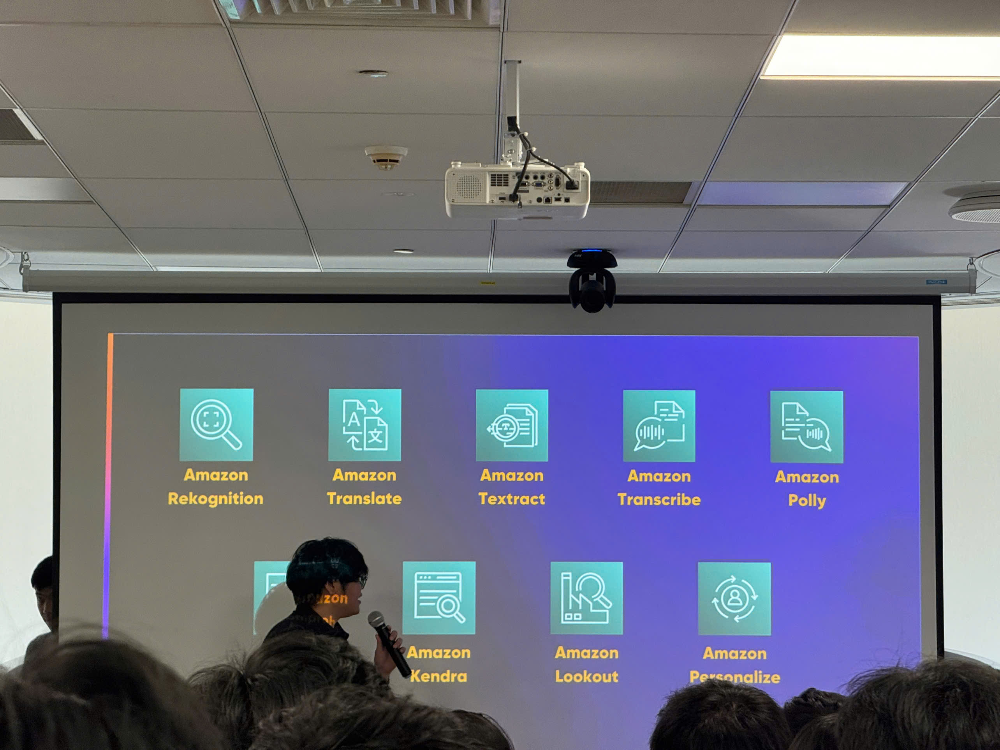
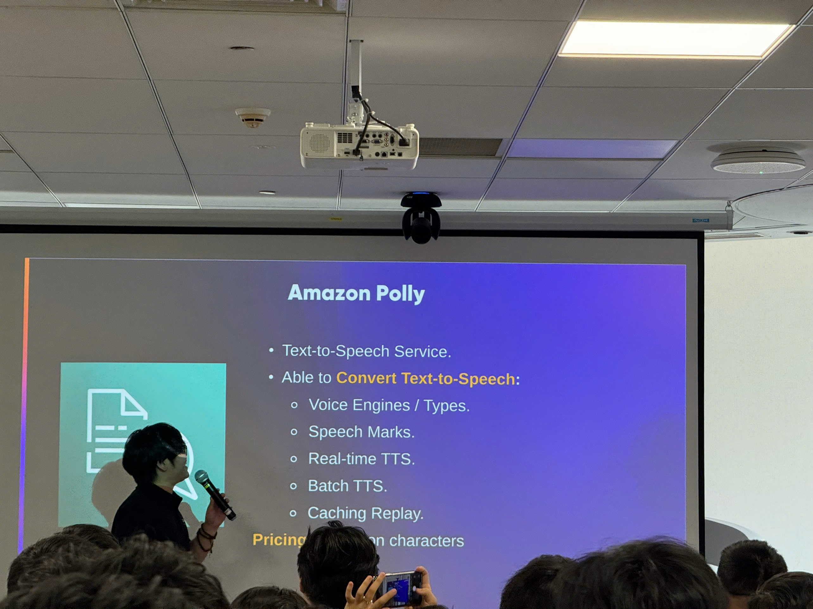
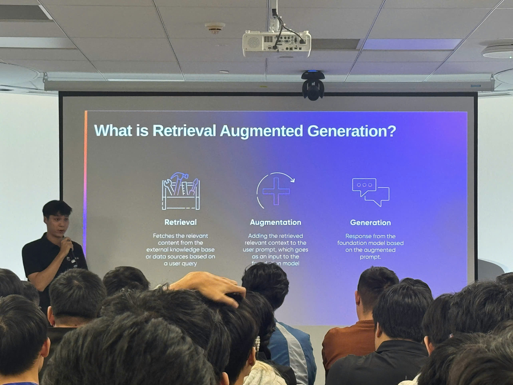
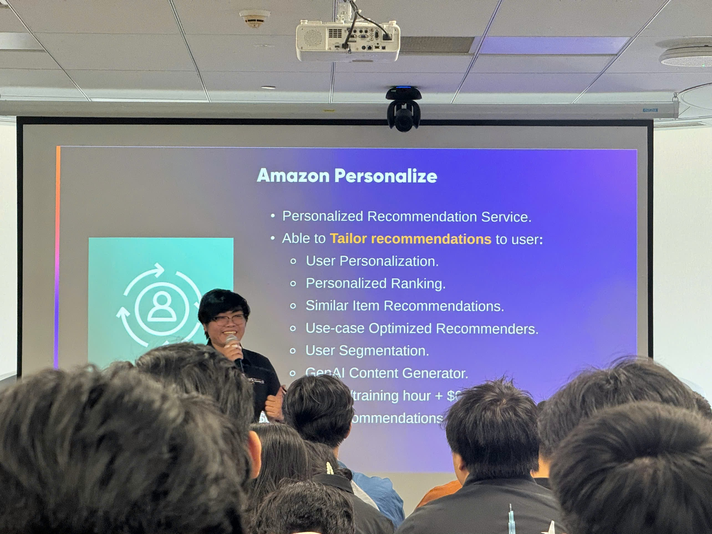

---
title: "Event 2"
date: 2025-09-10
weight: 1
chapter: false
pre: " <b> 4.22. </b> "
---

# Bài thu hoạch "AI/ML/GenAI on AWS"

### Mục Đích Của Sự Kiện

- Cung cấp tổng quan toàn diện về dịch vụ và khả năng AI/ML của AWS
- Giới thiệu Amazon SageMaker như một nền tảng ML end-to-end
- Khám phá Generative AI với Amazon Bedrock
- Minh họa các ứng dụng thực tế thông qua demo trực tiếp
- Chia sẻ best practices cho triển khai AI/ML tại Việt Nam

### Chi Tiết Sự Kiện

- **Ngày**: Thứ Bảy, 15 tháng 11 năm 2025
- **Thời gian**: 8:30 – 12:00
- **Địa điểm**: Văn phòng AWS Vietnam
- **Thời lượng**: 3.5 giờ (không bao gồm nghỉ trưa)

### Chương Trình

#### 8:30 – 9:00 | Đón tiếp & Giới thiệu

- Đăng ký tham gia và networking
- Tổng quan workshop và mục tiêu học tập
- Hoạt động phá băng
- Tổng quan về thị trường AI/ML tại Việt Nam

#### 9:00 – 10:30 | Tổng quan dịch vụ AWS AI/ML

- **Amazon SageMaker** – Nền tảng ML end-to-end
  - Chuẩn bị và gắn nhãn dữ liệu
  - Huấn luyện, tinh chỉnh và triển khai mô hình
  - Khả năng MLOps tích hợp
- **Demo trực tiếp**: Hướng dẫn SageMaker Studio

#### 10:30 – 10:45 | Nghỉ giải lao

#### 10:45 – 12:00 | Generative AI với Amazon Bedrock

- **Foundation Models**: Claude, Llama, Titan – so sánh & hướng dẫn lựa chọn
- **Prompt Engineering**: Kỹ thuật, Chain-of-Thought reasoning, Few-shot learning
- **Retrieval-Augmented Generation (RAG)**: Kiến trúc & Tích hợp Knowledge Base
- **Bedrock Agents**: Multi-step workflows và tích hợp công cụ
- **Guardrails**: An toàn và lọc nội dung
- **Demo trực tiếp**: Xây dựng chatbot Generative AI sử dụng Bedrock

### Nội Dung Nổi Bật

#### Nền Tảng Amazon SageMaker

- **Nền Tảng ML Toàn Diện**: Giải pháp hoàn chỉnh cho xây dựng, huấn luyện và triển khai mô hình machine learning
- **Chuẩn Bị Dữ Liệu**: Công cụ cho gắn nhãn dữ liệu, feature engineering, và validation dữ liệu
- **Huấn Luyện Mô Hình**: Hỗ trợ các framework và thuật toán ML khác nhau với khả năng huấn luyện phân tán
- **Triển Khai Mô Hình**: Các tùy chọn triển khai linh hoạt bao gồm real-time inference, batch processing, và serverless inference
- **Tích Hợp MLOps**: Khả năng tích hợp sẵn cho giám sát mô hình, versioning, và automated workflows

#### Generative AI với Amazon Bedrock

- **Lựa Chọn Foundation Model**: Hiểu sự khác biệt giữa các mô hình Claude, Llama, và Titan
  - **Claude**: Khả năng lý luận và trò chuyện mạnh mẽ
  - **Llama**: Mô hình mã nguồn mở với hiệu suất tốt
  - **Titan**: Mô hình do AWS phát triển được tối ưu cho các use case cụ thể
- **Kỹ Thuật Prompt Engineering**:
  - Chain-of-Thought reasoning cho giải quyết vấn đề phức tạp
  - Few-shot learning với ví dụ
  - Quản lý ngữ cảnh và tối ưu hóa prompt
- **Kiến Trúc RAG**: Kết hợp retrieval với generation cho phản hồi chính xác, nhận biết ngữ cảnh
  - Tích hợp knowledge base
  - Vector embeddings và similarity search
  - Chiến lược chunking tài liệu
- **Bedrock Agents**: Tác nhân tự động có thể thực hiện các tác vụ multi-step
  - Tích hợp công cụ và gọi API
  - Orchestration workflow
  - Khả năng ra quyết định
- **Guardrails cho An Toàn AI**: Lọc nội dung và kiểm soát an toàn
  - Phát hiện nội dung có hại
  - Cấu hình policy tùy chỉnh
  - Tuân thủ và quản trị

#### Thị Trường AI/ML tại Việt Nam

- Xu hướng và cơ hội áp dụng hiện tại
- Use cases cụ thể cho thị trường Việt Nam
- Thách thức và giải pháp cho doanh nghiệp địa phương
- Câu chuyện thành công và case studies

### Những Gì Học Được

#### Best Practices Machine Learning

- **Cách Tiếp Cận Nền Tảng End-to-end**: Sử dụng SageMaker cho quản lý vòng đời ML hoàn chỉnh
- **Chất Lượng Dữ Liệu Trước Tiên**: Đầu tư vào chuẩn bị và gắn nhãn dữ liệu để cải thiện hiệu suất mô hình
- **Tích Hợp MLOps**: Triển khai giám sát và automated workflows ngay từ đầu
- **Chiến Lược Lựa Chọn Mô Hình**: Chọn mô hình phù hợp dựa trên use case, không chỉ metrics hiệu suất

#### Triển Khai Generative AI

- **Lựa Chọn Foundation Model**: Hiểu điểm mạnh của từng mô hình (Claude, Llama, Titan) cho các scenario khác nhau
- **Thành Thạo Prompt Engineering**: Chain-of-Thought và Few-shot learning cải thiện đáng kể kết quả
- **RAG cho Độ Chính Xác**: Sử dụng kiến trúc RAG khi độ chính xác thực tế là quan trọng
- **Thiết Kế Agent**: Xây dựng agent có thể xử lý multi-step workflows với tích hợp công cụ phù hợp
- **An Toàn Trước Tiên**: Luôn triển khai guardrails cho lọc nội dung và tuân thủ

#### Sẵn Sàng Sản Xuất

- **Bắt Đầu Nhỏ, Mở Rộng Dần**: Bắt đầu với dự án thí điểm trước khi triển khai đầy đủ
- **Tối Ưu Chi Phí**: Giám sát và tối ưu chi phí inference với các tùy chọn serverless
- **Bảo Mật & Tuân Thủ**: Triển khai kiểm soát truy cập và biện pháp bảo mật dữ liệu phù hợp
- **Cải Thiện Liên Tục**: Giám sát hiệu suất mô hình và lặp lại dựa trên phản hồi thực tế

### Ứng Dụng Vào Công Việc

- **Khám Phá SageMaker**: Bắt đầu với SageMaker Studio cho thử nghiệm ML và phát triển mô hình
- **Triển Khai Giải Pháp RAG**: Xây dựng knowledge base cho ứng dụng domain-specific sử dụng kiến trúc RAG
- **Phát Triển Bedrock Agents**: Tạo tác nhân tự động cho dịch vụ khách hàng hoặc tự động hóa workflow
- **Thực Hành Prompt Engineering**: Áp dụng kỹ thuật Chain-of-Thought và Few-shot để cải thiện phản hồi AI
- **Triển Khai Guardrails**: Triển khai lọc nội dung và kiểm soát an toàn cho ứng dụng GenAI sản xuất
- **Thiết Lập MLOps**: Thiết lập giám sát mô hình và automated deployment pipelines sử dụng khả năng SageMaker

### Trải nghiệm trong event

Tham gia workshop **"AI/ML/GenAI on AWS"** là một trải nghiệm học tập đặc biệt cung cấp hiểu biết toàn diện về khả năng AI và machine learning của AWS. Sự kiện kết hợp kiến thức lý thuyết với các trình diễn thực tế, giúp em hiểu rõ cách triển khai giải pháp AI/ML trên AWS.

#### Học từ chương trình toàn diện

- Chương trình có cấu trúc bao phủ mọi thứ từ khái niệm ML cơ bản đến triển khai Generative AI nâng cao.
- Bắt đầu với tổng quan nền tảng SageMaker giúp em hiểu vòng đời ML hoàn chỉnh trước khi đi sâu vào chi tiết GenAI.
- Sự tiến triển từ ML truyền thống đến Generative AI cho thấy sự tiến hóa và tính bổ sung của các công nghệ này.

#### Trải nghiệm kỹ thuật thực hành

- **Hướng dẫn SageMaker Studio** minh họa quy trình thực tế xây dựng mô hình ML, từ chuẩn bị dữ liệu đến triển khai.
- Em học về các công cụ **gắn nhãn dữ liệu** và cách chúng có thể cải thiện đáng kể độ chính xác mô hình với chất lượng dữ liệu phù hợp.
- **Khả năng MLOps** cho em thấy cách triển khai continuous integration và giám sát cho mô hình ML trong sản xuất.

#### Tìm hiểu sâu về Generative AI

- Phiên **Amazon Bedrock** rất mở mang tầm mắt, cho em thấy cách tận dụng foundation models mà không cần huấn luyện từ đầu.
- **Kỹ thuật Prompt Engineering** như Chain-of-Thought reasoning và Few-shot learning được minh họa với các ví dụ thực tế.
- Học về **kiến trúc RAG** giúp em hiểu cách xây dựng ứng dụng AI chính xác kết hợp retrieval với generation.
- **Demo Bedrock Agents** cho thấy cách xây dựng hệ thống AI tự động có thể thực hiện các tác vụ multi-step phức tạp.

#### Trình diễn thực tế

- Demo trực tiếp xây dựng **chatbot Generative AI** sử dụng Bedrock cho em bức tranh hoàn chỉnh về triển khai từ đầu đến cuối.
- Xem **Guardrails hoạt động** minh chứng tầm quan trọng của an toàn và lọc nội dung trong ứng dụng GenAI sản xuất.
- So sánh giữa các mô hình Claude, Llama, và Titan giúp em hiểu khi nào sử dụng mỗi mô hình.

#### Kết nối và thảo luận

- Workshop cung cấp cơ hội networking tuyệt vời với các người đam mê và thực hành AI/ML khác tại Việt Nam.
- Thảo luận về **thị trường AI/ML tại Việt Nam** cho em hiểu biết theo ngữ cảnh về cơ hội và thách thức thị trường địa phương.
- Chia sẻ kinh nghiệm với đồng nghiệp giúp em hiểu các thách thức và giải pháp triển khai thực tế.

#### Bài học rút ra

- **SageMaker cung cấp một nền tảng hoàn chỉnh** đơn giản hóa toàn bộ vòng đời ML, từ chuẩn bị dữ liệu đến triển khai.
- **Foundation models trong Bedrock** loại bỏ nhu cầu huấn luyện mô hình lớn từ đầu, giảm đáng kể thời gian và chi phí.
- **Kiến trúc RAG là quan trọng** cho xây dựng ứng dụng GenAI chính xác cần tham chiếu knowledge base cụ thể.
- **Prompt engineering là một kỹ năng** đòi hỏi thực hành và hiểu biết các kỹ thuật khác nhau để có kết quả tối ưu.
- **Guardrails là cần thiết** cho ứng dụng GenAI sản xuất để đảm bảo an toàn và tuân thủ.

#### Một số hình ảnh khi tham gia sự kiện

> Tổng thể, workshop này cung cấp cho em cả kiến thức nền tảng và kỹ năng thực tế cần thiết để triển khai giải pháp AI/ML và Generative AI trên AWS. Sự kết hợp giữa tổng quan nền tảng toàn diện, khả năng GenAI chi tiết, và các trình diễn thực hành cho em tự tin bắt đầu xây dựng các ứng dụng được hỗ trợ bởi AI.
