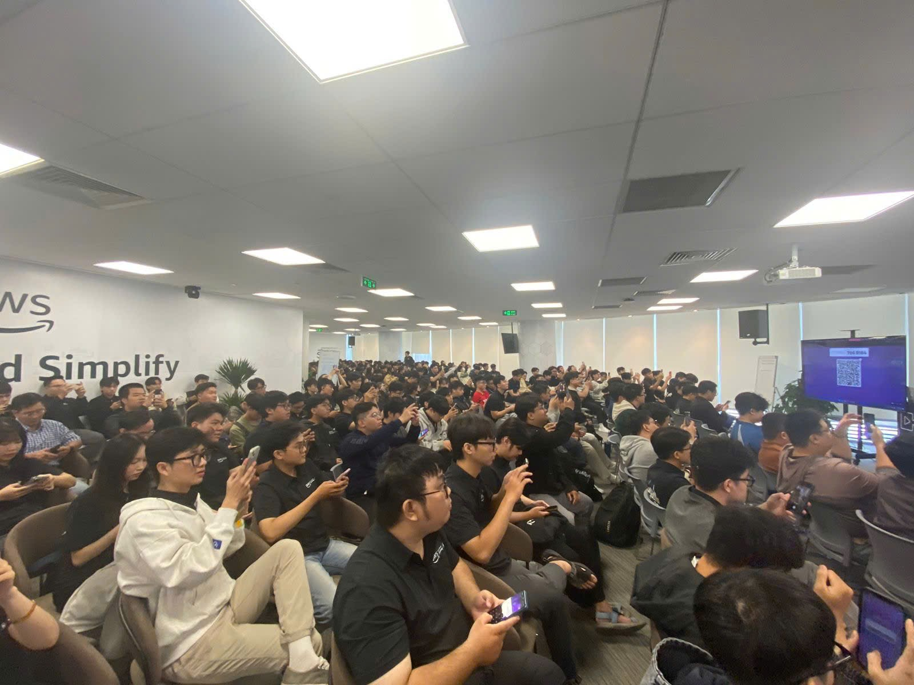
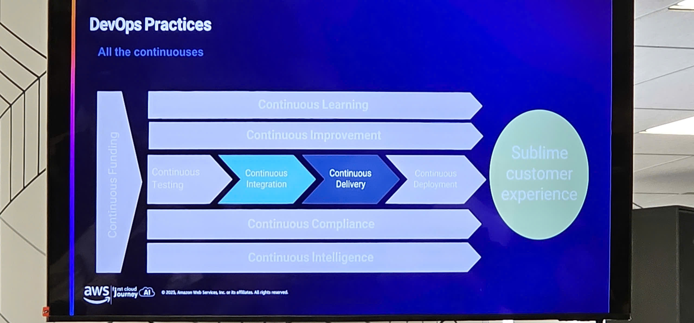
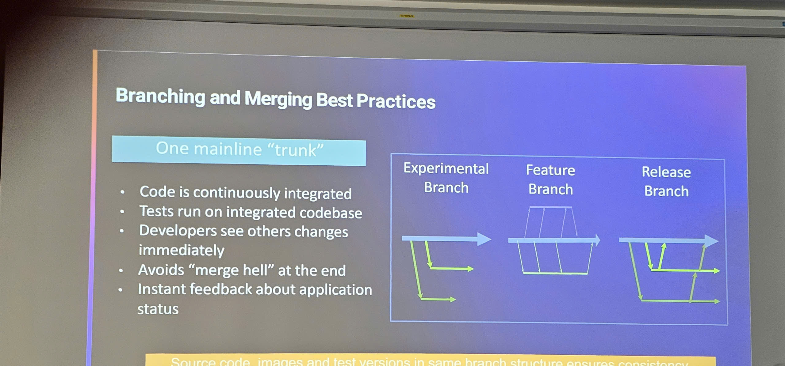
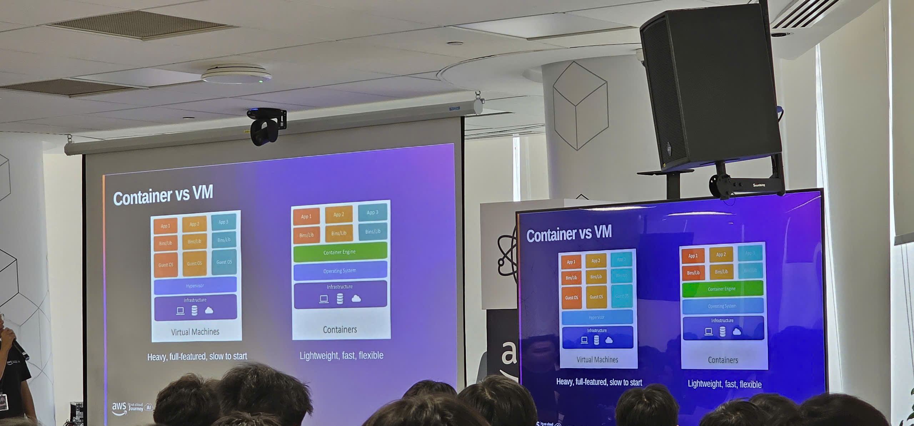

---
title: "Event 3"
date: 2025-09-10
weight: 1
chapter: false
pre: " <b> 4.3. </b> "
---

# Bài thu hoạch "DevOps on AWS"

### Mục Đích Của Sự Kiện

- Giới thiệu văn hóa, nguyên tắc và các metrics chính của DevOps
- Trình diễn các dịch vụ AWS DevOps cho tự động hóa CI/CD pipeline
- Khám phá Infrastructure as Code (IaC) với CloudFormation và CDK
- Bao phủ các dịch vụ container và chiến lược triển khai microservices
- Cung cấp best practices về monitoring và observability
- Chia sẻ case studies DevOps thực tế và best practices

### Chi Tiết Sự Kiện

- **Ngày**: Thứ Hai, 17 tháng 11 năm 2025
- **Thời gian**: 08:30 – 17:00
- **Địa điểm**: Tòa nhà Bitexco Financial Tower, 2 Đ. Hải Triều, Bến Nghé, Quận 1, Thành phố Hồ Chí Minh
- **Thời lượng**: Cả ngày (8.5 giờ với các giờ nghỉ)

### Chương Trình

#### Buổi Sáng (8:30 AM – 12:00 PM)

**8:30 – 9:00 | Đón tiếp & DevOps Mindset**

- Tóm tắt lại phiên AI/ML
- Văn hóa và nguyên tắc DevOps
- Lợi ích và các metrics chính (DORA, MTTR, tần suất deployment)

**9:00 – 10:30 | Dịch vụ AWS DevOps – CI/CD Pipeline**

- **Source Control**: AWS CodeCommit, Git strategies (GitFlow, Trunk-based)
- **Build & Test**: Cấu hình CodeBuild, testing pipelines
- **Deployment**: CodeDeploy với Blue/Green, Canary, và Rolling updates
- **Orchestration**: Tự động hóa CodePipeline
- **Demo**: Hướng dẫn CI/CD pipeline đầy đủ

**10:30 – 10:45 | Nghỉ giải lao**

**10:45 – 12:00 | Infrastructure as Code (IaC)**

- **AWS CloudFormation**: Templates, stacks, và drift detection
- **AWS CDK (Cloud Development Kit)**: Constructs, reusable patterns, và language support
- **Demo**: Triển khai với CloudFormation và CDK
- **Thảo luận**: Lựa chọn giữa các công cụ IaC

#### Nghỉ Trưa (12:00 – 13:00)

#### Buổi Chiều (13:00 – 17:00)

**13:00 – 14:30 | Dịch Vụ Container trên AWS**

- **Docker Fundamentals**: Microservices và containerization
- **Amazon ECR**: Lưu trữ image, scanning, lifecycle policies
- **Amazon ECS & EKS**: Chiến lược deployment, scaling, và orchestration
- **AWS App Runner**: Triển khai container đơn giản
- **Demo & Case Study**: So sánh triển khai microservices

**14:30 – 14:45 | Nghỉ giải lao**

**14:45 – 16:00 | Monitoring & Observability**

- **CloudWatch**: Metrics, logs, alarms, và dashboards
- **AWS X-Ray**: Distributed tracing và performance insights
- **Demo**: Thiết lập full-stack observability
- **Best Practices**: Alerting, dashboards, và quy trình on-call

**16:00 – 16:45 | DevOps Best Practices & Case Studies**

- Chiến lược deployment: Feature flags, A/B testing
- Automated testing và tích hợp CI/CD
- Quản lý incident và postmortems
- Case Studies: Chuyển đổi DevOps của startups và enterprise

**16:45 – 17:00 | Q&A & Tổng kết**

- Con đường nghề nghiệp DevOps
- Lộ trình chứng chỉ AWS

### Nội Dung Nổi Bật

#### Văn Hóa và Nguyên Tắc DevOps

- **DevOps Mindset**: Hợp tác giữa các team development và operations
- **Chuyển Đổi Văn Hóa**: Phá vỡ silos và thúc đẩy trách nhiệm chia sẻ
- **Metrics Chính (DORA)**: Đo lường hiệu suất DevOps
  - **Deployment Frequency**: Tần suất triển khai xảy ra
  - **Lead Time**: Thời gian từ code commit đến production
  - **MTTR (Mean Time To Recovery)**: Thời gian khôi phục sau lỗi
  - **Change Failure Rate**: Tỷ lệ phần trăm các deployment gây lỗi
- **Lợi Ích**: Giao hàng nhanh hơn, độ tin cậy cải thiện, hợp tác tốt hơn

#### Dịch Vụ AWS CI/CD Pipeline

**AWS CodeCommit:**

- Dịch vụ source control được quản lý đầy đủ
- Version control dựa trên Git
- Tích hợp với các dịch vụ AWS khác
- Git strategies: GitFlow, Trunk-based development, feature branches

**AWS CodeBuild:**

- Dịch vụ build được quản lý đầy đủ
- Môi trường build có thể mở rộng
- Hỗ trợ nhiều ngôn ngữ lập trình và công cụ build
- Build artifacts và test reports
- Tích hợp với testing frameworks

**AWS CodeDeploy:**

- Dịch vụ deployment tự động
- Chiến lược deployment:
  - **Blue/Green**: Triển khai zero-downtime với rollback tức thì
  - **Canary**: Rollout dần dần với rollback tự động khi có lỗi
  - **Rolling**: Cập nhật rolling với kích thước batch có thể cấu hình
- Triển khai ứng dụng trên EC2, Lambda, và on-premises

**AWS CodePipeline:**

- Dịch vụ continuous delivery được quản lý đầy đủ
- Trình tạo workflow trực quan
- Tích hợp với công cụ bên thứ ba
- Orchestration pipeline tự động
- Approval gates và điểm can thiệp thủ công

#### Infrastructure as Code (IaC)

**AWS CloudFormation:**

- Dịch vụ IaC khai báo
- Cú pháp template JSON/YAML
- Quản lý stack và cung cấp tài nguyên
- Drift detection và cập nhật stack
- Change sets để xem trước thay đổi
- Nested stacks cho hạ tầng modular

**AWS CDK (Cloud Development Kit):**

- IaC lập trình sử dụng ngôn ngữ lập trình quen thuộc
- Hỗ trợ TypeScript, Python, Java, C#, và Go
- Constructs cho các pattern hạ tầng có thể tái sử dụng
- Abstractions cấp cao hơn và best practices
- Tích hợp với CloudFormation
- CLI tools cho deployment và quản lý

**Lựa Chọn Giữa Các Công Cụ IaC:**

- CloudFormation: Khai báo, dựa trên template, AWS-native
- CDK: Lập trình, type-safe, thân thiện với developer
- Use cases và khi nào chọn mỗi cách tiếp cận

#### Dịch Vụ Container trên AWS

**Docker Fundamentals:**

- Lợi ích containerization và use cases
- Kiến trúc microservices với containers
- Tạo và tối ưu Docker image
- Multi-stage builds và best practices

**Amazon ECR (Elastic Container Registry):**

- Docker container registry được quản lý đầy đủ
- Lưu trữ và versioning image
- Scanning image để tìm lỗ hổng
- Lifecycle policies cho cleanup tự động
- Tích hợp với ECS và EKS

**Amazon ECS (Elastic Container Service):**

- Container orchestration được quản lý đầy đủ
- Fargate (serverless) và EC2 launch types
- Task definitions và service configurations
- Auto-scaling và load balancing
- Service discovery và networking

**Amazon EKS (Elastic Kubernetes Service):**

- Dịch vụ Kubernetes được quản lý
- Kubernetes-native orchestration
- Quản lý worker nodes
- Add-ons và tích hợp ecosystem
- Multi-tenant và namespace isolation

**AWS App Runner:**

- Triển khai container đơn giản
- Auto-scaling và load balancing tự động
- Triển khai source code hoặc container image
- Tích hợp CI/CD tích hợp sẵn
- Mô hình định giá pay-per-use

#### Monitoring & Observability

**Amazon CloudWatch:**

- **Metrics**: Metrics ứng dụng và hạ tầng
- **Logs**: Quản lý và phân tích log tập trung
- **Alarms**: Alerting và thông báo tự động
- **Dashboards**: Trực quan hóa tùy chỉnh metrics và logs
- **Insights**: Phát hiện bất thường tự động
- **Composite Alarms**: Logic cảnh báo phức tạp

**AWS X-Ray:**

- Distributed tracing cho microservices
- Trực quan hóa luồng request
- Xác định bottleneck hiệu suất
- Tạo service map
- Tích hợp với Lambda, ECS, và API Gateway
- Phân tích và lọc trace

**Best Practices:**

- Thiết lập chiến lược alerting hiệu quả
- Tạo dashboards có ý nghĩa
- Quy trình on-call và incident response
- Tổng hợp và phân tích log
- Thu thập metrics và retention policies

#### DevOps Best Practices

**Chiến Lược Deployment:**

- **Feature Flags**: Rollout tính năng dần dần
- **A/B Testing**: So sánh các phiên bản khác nhau
- **Canary Deployments**: Giảm thiểu rủi ro thông qua rollout dần dần
- **Blue/Green Deployments**: Cập nhật zero-downtime

**Automated Testing:**

- Unit, integration, và end-to-end testing
- Test automation trong CI/CD pipelines
- Quality gates và test coverage
- Performance và load testing

**Quản Lý Incident:**

- Tạo và bảo trì runbook
- Quy trình incident response
- Phân tích postmortem và học hỏi
- Quy trình cải thiện liên tục

### Những Gì Học Được

#### Chuyển Đổi Văn Hóa DevOps

- **Thay Đổi Văn Hóa Là Căn Bản**: Chỉ công cụ không tạo ra DevOps—văn hóa và hợp tác là chìa khóa
- **Đo Lường Những Gì Quan Trọng**: Sử dụng DORA metrics để theo dõi mức độ trưởng thành DevOps
- **Cải Thiện Liên Tục**: DevOps là một hành trình, không phải đích đến
- **Tự Động Hóa Trước Tiên**: Tự động hóa các tác vụ lặp đi lặp lại để tập trung vào công việc có giá trị cao

#### Best Practices CI/CD

- **Bắt Đầu Đơn Giản, Mở Rộng Dần**: Bắt đầu với pipeline cơ bản và thêm phức tạp theo thời gian
- **Git Strategy Quan Trọng**: Chọn GitFlow hoặc Trunk-based dựa trên kích thước team và nhịp độ release
- **Testing Là Quan Trọng**: Tích hợp automated testing ở mọi giai đoạn
- **Chiến Lược Deployment**: Sử dụng chiến lược deployment phù hợp dựa trên mức độ chấp nhận rủi ro
- **Infrastructure as Code**: Luôn sử dụng IaC cho hạ tầng có thể tái tạo và được version control

#### Container Orchestration

- **Chọn Thông Minh**: ECS cho đơn giản, EKS cho ecosystem Kubernetes
- **Bắt Đầu Với Serverless**: Fargate loại bỏ overhead quản lý node
- **Tối Ưu Images**: Image nhỏ hơn có nghĩa là deployment nhanh hơn và chi phí thấp hơn
- **Bảo Mật Trước Tiên**: Scan images và sử dụng IAM policies least-privilege

#### Chiến Lược Observability

- **Triển Khai Full-Stack Observability**: Metrics, logs, và traces cùng nhau
- **Monitoring Chủ Động**: Thiết lập alarms trước khi incident xảy ra
- **Dashboards Có Ý Nghĩa**: Tạo dashboards cung cấp insights có thể hành động
- **Distributed Tracing**: Cần thiết cho debug kiến trúc microservices

### Ứng Dụng Vào Công Việc

- **Triển Khai CI/CD Pipelines**: Thiết lập CodePipeline cho deployments tự động
- **Áp Dụng Infrastructure as Code**: Sử dụng CloudFormation hoặc CDK cho tất cả hạ tầng
- **Containerize Applications**: Bắt đầu containerize ứng dụng để portability tốt hơn
- **Thiết Lập Monitoring**: Triển khai CloudWatch và X-Ray cho observability
- **Thiết Lập DevOps Practices**: Tạo runbooks, quy trình incident response, và templates postmortem
- **Đo Lường DevOps Metrics**: Theo dõi DORA metrics để đo lường cải thiện

### Trải nghiệm trong event

Tham gia workshop **"DevOps on AWS"** cả ngày là một trải nghiệm học tập chuyên sâu và toàn diện bao phủ toàn bộ phạm vi DevOps từ văn hóa đến triển khai. Sự kiện cung cấp cả kiến thức lý thuyết và trình diễn thực tế, giúp em hiểu hoàn chỉnh về triển khai DevOps practices trên AWS.

#### Học các nguyên tắc cơ bản DevOps

- Phiên bắt đầu với **DevOps mindset và văn hóa**, nhấn mạnh rằng DevOps không chỉ là công cụ—đó là về hợp tác và trách nhiệm chia sẻ.
- Em học về **DORA metrics** (Deployment Frequency, Lead Time, MTTR, Change Failure Rate) và cách đo lường mức độ trưởng thành DevOps.
- Hiểu **lợi ích của DevOps** giúp em thấy bức tranh lớn hơn ngoài triển khai kỹ thuật.

#### Tìm hiểu sâu về AWS CI/CD pipeline

- **Hướng dẫn CodeCommit, CodeBuild, CodeDeploy, và CodePipeline** cho em thấy cách xây dựng CI/CD pipeline hoàn chỉnh.
- Học về các **Git strategies** khác nhau (GitFlow vs Trunk-based) giúp em hiểu khi nào sử dụng mỗi cách tiếp cận.
- **Demo chiến lược deployment** (Blue/Green, Canary, Rolling) rất mở mang tầm mắt, cho thấy cách giảm thiểu rủi ro và downtime.
- **Demo CI/CD pipeline trực tiếp** minh họa toàn bộ workflow từ code commit đến production deployment.

#### Thành thạo Infrastructure as Code

- **CloudFormation** minh họa cách quản lý hạ tầng khai báo với templates.
- **AWS CDK** cho em thấy cách viết code hạ tầng bằng ngôn ngữ lập trình quen thuộc, làm cho nó dễ bảo trì hơn.
- So sánh giữa CloudFormation và CDK giúp em hiểu khi nào sử dụng mỗi công cụ.
- Học về **drift detection** và **change sets** cho em tự tin quản lý hạ tầng an toàn.

#### Khám phá dịch vụ container

- **Docker fundamentals** làm mới hiểu biết của em về containerization và lợi ích của nó.
- **Amazon ECR** cho thấy cách quản lý container images an toàn với scanning và lifecycle policies.
- So sánh **ECS và EKS** giúp em hiểu trade-offs giữa dịch vụ được quản lý và tính linh hoạt Kubernetes.
- **AWS App Runner** giới thiệu cách triển khai container đơn giản hơn mà không cần quản lý hạ tầng.
- **Case study triển khai microservices** cung cấp insights thực tế về lựa chọn dịch vụ container phù hợp.

#### Thiết lập monitoring và observability

- **CloudWatch** bao phủ toàn diện cho em thấy cách thu thập metrics, logs, và thiết lập alarms.
- **AWS X-Ray** distributed tracing minh họa cách debug kiến trúc microservices phức tạp.
- **Demo full-stack observability** cho thấy cách kết nối tất cả các phần monitoring lại với nhau.
- Học về **best practices alerting** và **quy trình on-call** cung cấp kiến thức vận hành thực tế.

#### Best practices và case studies

- **Chiến lược deployment** như feature flags và A/B testing cho thấy kỹ thuật nâng cao cho deployments an toàn.
- **Tích hợp automated testing** minh họa cách xây dựng quality gates vào CI/CD pipelines.
- **Quản lý incident** practices và templates postmortem cung cấp cấu trúc cho xử lý các vấn đề production.
- **Case studies** từ startups và enterprises cho thấy chuyển đổi DevOps thực tế và bài học học được.

#### Hướng dẫn nghề nghiệp và chứng chỉ

- **Thảo luận con đường nghề nghiệp DevOps** giúp em hiểu các vai trò và yêu cầu kỹ năng khác nhau.
- **Lộ trình chứng chỉ AWS** cung cấp hướng dẫn rõ ràng về các chứng chỉ liên quan đến DevOps.
- Hiểu sự tiến triển nghề nghiệp cho em lộ trình phát triển chuyên nghiệp.

#### Trình diễn thực tế

- Mọi phiên đều bao gồm **demo trực tiếp** cho thấy triển khai thực tế, không chỉ slides.
- **Hướng dẫn CI/CD pipeline đầy đủ** minh họa tự động hóa end-to-end.
- **Demo CloudFormation và CDK** cho thấy cả hai cách tiếp cận quản lý hạ tầng.
- **So sánh triển khai container** giúp em hình dung các cách tiếp cận khác nhau cạnh nhau.

#### Kết nối và thảo luận

- Định dạng cả ngày cho phép **networking mở rộng** với các DevOps practitioners khác.
- **Phiên Q&A** cung cấp cơ hội nhận câu trả lời cho các câu hỏi cụ thể.
- Thảo luận **thách thức thực tế** với đồng nghiệp giúp em hiểu các pitfalls và giải pháp phổ biến.

#### Bài học rút ra

- **DevOps là chuyển đổi văn hóa** đòi hỏi sự đồng thuận từ cả team development và operations.
- **Tự động hóa là cần thiết** nhưng phải được triển khai cẩn thận để tránh tạo technical debt.
- **Infrastructure as Code** là không thể thương lượng cho DevOps practices hiện đại.
- **Monitoring và observability** là quan trọng cho duy trì hệ thống production.
- **Bắt đầu đơn giản và lặp lại** thay vì cố gắng triển khai mọi thứ cùng một lúc.
- **Đo lường mọi thứ** sử dụng DORA metrics để theo dõi cải thiện theo thời gian.

#### Một số hình ảnh khi tham gia sự kiện

> Tổng thể, workshop cả ngày này cung cấp cho em kiến thức toàn diện về dịch vụ AWS DevOps và best practices. Sự kết hợp giữa nguyên tắc chuyển đổi văn hóa, trình diễn công cụ thực tế, và case studies thực tế cho em tự tin triển khai DevOps practices trong các dự án của em. Độ sâu và phạm vi nội dung bao phủ mọi thứ từ CI/CD pipelines đến container orchestration và observability, cung cấp nền tảng hoàn chỉnh cho xây dựng khả năng DevOps trên AWS.
